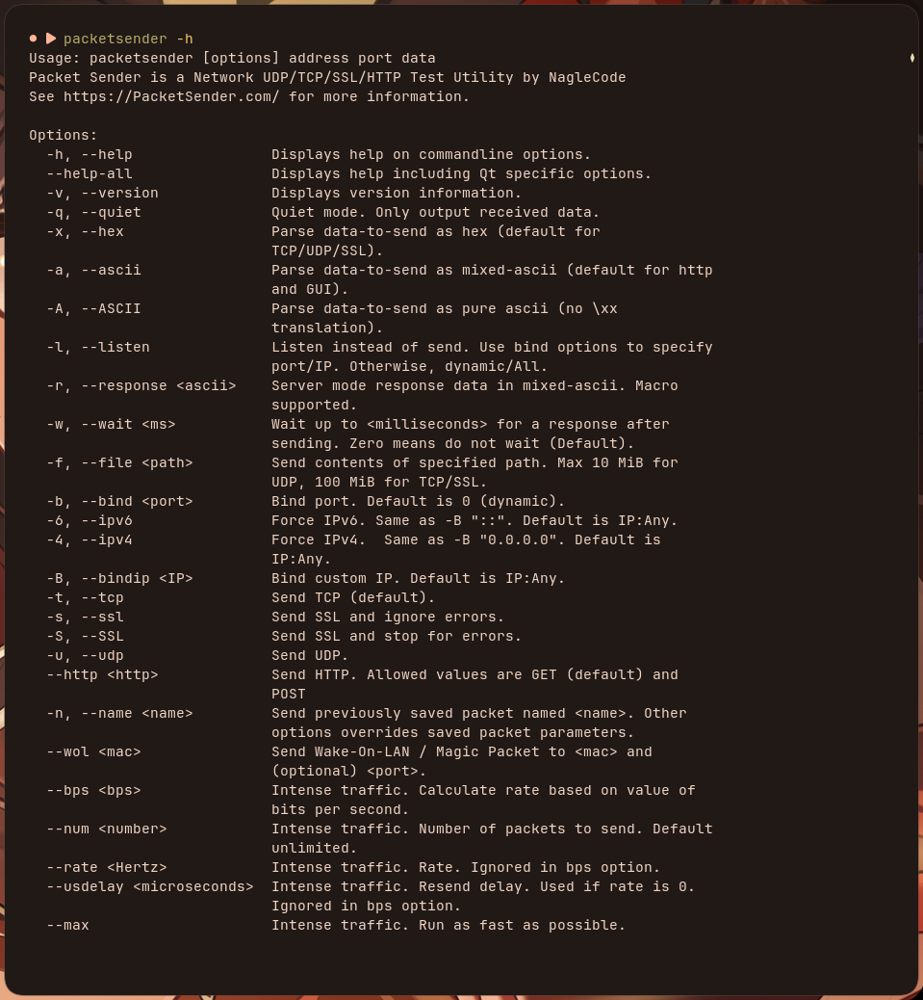
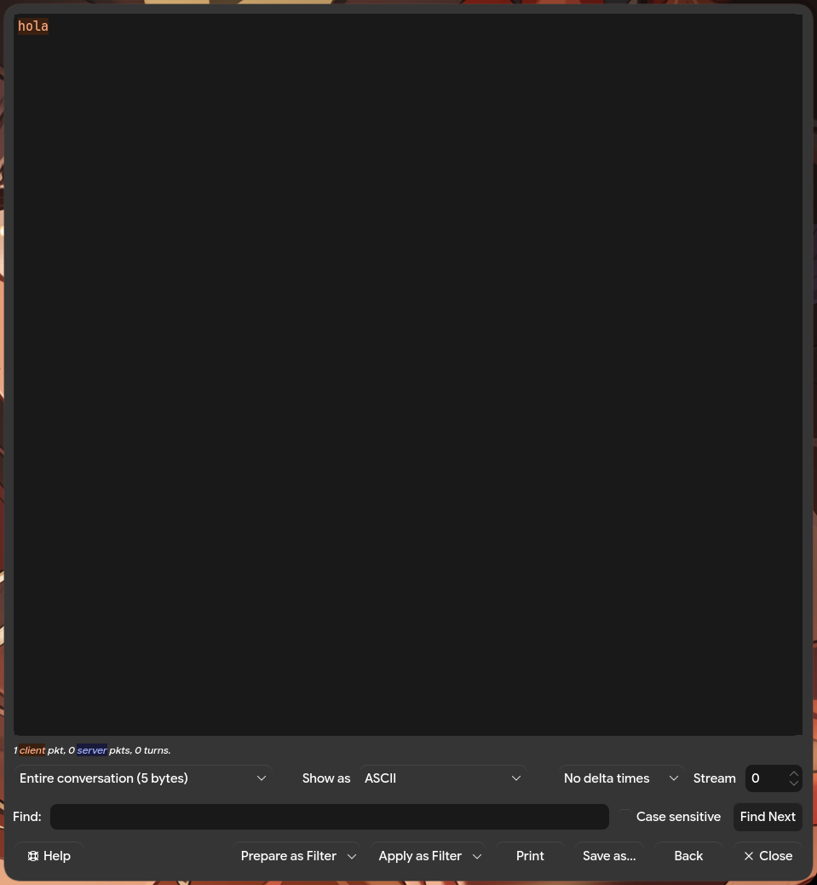

# UNIVERSIDAD NACIONAL DE CÓRDOBA
### Facultad de Ciencias Exactas, Físicas y Naturales

## Redes de Computadoras
## Trabajo Práctico de Teórico Nº4: Capas de Acceso en Redes Locales, Protocolos y Fundamentos

#### Comisión: ICOMP 24-3
#### Docentes: Oliva, Facundo
#### Alumnos:
- Lamas, Matías Angel
- Torres Sosa, Candelaria
- Baiutti, Bruno Augusto
- Sanchez Oliveto, Juan Cruz
- Vazquez Zuloeta, Fabian
- Pinque, Emanuel Leandro
- Mayne, William Annesley

#### Año: 2026

---

## Item 1

- **B)**
    Una dirección MAC (Media Access Control) es un id único de 48 bits grabado en la tarjeta de red (NIC) de un dispositivo, de esta forma es posible identificar de manera inequívoca a un dispositivo en una red LAN. Por otro lado, la dirección IP (Internet Protocol) es una dirección entre redes, que permite ubicar a un destinatario de un paquete de manera sencilla, no deja de ser público mientras que la dirección MAC solo la conoce la red interna, LAN o WAN.

- **C)**
    La trama ethernet, transmitida en la capa de enlace de datos, es una trama de entre 64 y 1518 bytes. Esta trama contiene los siguientes elementos de cabecera:
    - Preámbulo - SFD 8 bytes: Una ristra de 0s y 1s alternados para sincronizar el reloj del receptor
    - MAC Destino 6 bytes
    - MAC Origen 6 bytes
    - Ether type 2 bytes: identifica el tipo de protocolo que viene en la capa 3, IPv4 o IPv6
    - Payload 46 - 1500 bytes: paquete IP real con un padding de al menos 46 bytes
    - Frecuencia de Verificación de trama (FCR): Es el código de redundancia cíclica de esta capa que le permite al receptor identificar errores

- **D)**
    El encargado es el Ether type, donde tenemos que:
    - 0x0800 -> IPv4
    - 0x86DD -> IPv6
    - 0x0806 -> ARP

---

## Item 2

- **A)**
    El paquete observado bajo la arquitectura del protocolo TCP (al acceder a YouTube) proviene de la IP pública 142.251.155.4, perteneciente a los servidores de Google. En este evento se registra la siguiente trama Ethernet II:

    ```
    24 4b fe 82 39 3d 02 10 18 cf 61 74 08 00
    ```

    En este encabezado podemos identificar:
    - **MAC de Origen:** 02:10:18:cf:61:74 — Corresponde al gateway (router local). Su prefijo es resuelto por Wireshark como MS-NLB (Microsoft Network Load Balancing).
    - **MAC de Destino:** 24:4b:fe:82:39:3d — Dirección física de la tarjeta de red de la computadora receptora.

- **D)**
    Los últimos dos bytes del encabezado de la trama Ethernet (0x0800) representan el campo EtherType. Este valor le comunica a la capa de enlace que el protocolo encapsulado en la capa de red superior corresponde a IPv4.

- **B)**
    En el encabezado del protocolo IP (Capa de Red), se identifican las siguientes direcciones de capa 3:
    - **IP de Origen:** 142.251.155.4 — Dirección pública perteneciente a los servidores de Google (servicios de YouTube).
    - **IP de Destino:** 192.168.0.77 — Dirección privada asignada a la computadora receptora dentro de la red local.

- **C)**
    Las direcciones MAC e IP cumplen funciones completamente distintas dentro del modelo de red:
    - **Dirección MAC (Capa 2):** Tiene alcance exclusivo dentro de la red local (LAN). Cambia en cada salto de red, por lo que la MAC de origen observada (02:10:18:cf:61:74) corresponde al router local (gateway) y no al emisor final.
    - **Dirección IP (Capa 3):** Identifica el origen y destino finales a nivel global. Se mantiene a lo largo de toda la ruta a través de Internet.

---

## Item 3

1.
A diferencia de las demas capas:

- IP(capa de red):Esta proporcina un servicio de mejor esfuerzo para entregar los datagramas del host de origen al host de destino, pero no ofrece una garantia que dichos datos llegues correctamente en orden o que se dupliquen o corrompan

- Etherner (Capa enlace):Se encarga del transporte de tramas entre dispositivos directamente conectados en un mismo segmentpo de red local, si bien detecta errores locales mediante CRC no realiza retrasmicionni control de flujo de extremo a extremo a traves de routers

- TCP (capa trasnporte):ahora este si resuelve el trasporte end to end entre aplicaciones mediante:


* **Transferencia confiable de datos:** Garantiza que los datos lleguen sin errores, retransmitiendo segmentos perdidos o dañados.
* **Entrega ordenada:** Utiliza números de secuencia para reordenar los paquetes que llegan fuera de secuencia.
* **Eliminación de duplicados:** Identifica y descarta copias repetidas mediante los números de secuencia.
* **Control de flujo:** Evita que el emisor sature el búfer de recepción del receptor mediante la ventana deslizante.
* **Control de congestión:** Modula la velocidad de envío para no saturar los routers intermedios de la red.
* **Multiplexación/Desmultiplexación:** Permite diferenciar el tráfico de múltiples aplicaciones dentro del mismo host mediante números de puerto.

B
Un segmento TCP incluye una cabecera (*header*) estructurada con los siguientes campos principales[8]:

* **Puerto de Origen (** **Source Port** **, 16 bits) y Puerto de Destino (** **Destination Port** **, 16 bits):** Identifican los procesos o aplicaciones emisora y receptora en los hosts extremos.
* **Número de Secuencia (** **Sequence Number** **, 32 bits):** Indica la posición del primer byte de datos de este segmento dentro del flujo continuo de bytes transmitido.
* **Número de Reconocimiento (** **Acknowledgment Number** **, 32 bits):** Número del siguiente byte que la entidad receptora espera recibir (confirmación acumulativa).
* **Longitud de Cabecera / Offset (** **Data Offset** **, 4 bits):** Especifica el tamaño de la cabecera TCP en palabras de 32 bits.
* **Flags / Bits de Control (6 bits o más):**
  * **SYN:** Inicia y sincroniza el establecimiento de la conexión.
  * **ACK:** Indica que el campo *Acknowledgment Number* es válido.
  * **FIN:** Solicita la finalización/cierre de la conexión de forma ordenada.
  * **RST:** Fuerza el reinicio inmediato de una conexión anormal o rechazada.
  * **PSH:** Solicita que los datos se entreguen inmediatamente a la aplicación sin esperar a llenar el búfer.
  * **URG:** Señala que el segmento contiene datos urgentes.
* **Tamaño de Ventana (** **Window Size** **, 16 bits):** Indica la cantidad de bytes que el receptor está dispuesto a aceptar en su búfer (control de flujo).
* **Suma de Comprobación (** **Checksum** **, 16 bits):** Utilizada para la detección de errores en la cabecera y datos (utilizando el complemento a 1).


C)
**Three-Way Handshake (Establecimiento de Conexión)**
Antes de intercambiar datos, el cliente y el servidor negocian los parámetros iniciales en tres pasos

- 1 `SYN`: El cliente envía un segmento con la bandera SYN = 1 y un número de secuencia inicial aleatorio ($Seq = x$)

- 2 `SY-ACK`:El servidor responde con un segmento con las banderas SYN = 1 y ACK = 1, confirmando el número de secuencia del cliente ($Ack = x + 1$) y enviando su propio número de secuencia inicial ($Seq = y$)

- `ACK`:El cliente responde con ACK = 1, confirmando la secuencia del servidor ($Ack = y + 1$). Este segmento ya puede transportar datos de la capa de aplicación

**Four-Way Handshake / Teardown (Cierre de Conexión)**

Cualquiera de los dos extremos puede iniciar la finalización de la conexión de forma simétrica:


- (`FIN` cliente $\rightarrow$ servidor): El cliente envía un segmento con FIN = 1 ($Seq = a$) para cerrar el flujo de datos en su -

- (`ACK` servidor $\rightarrow$ cliente): El servidor confirma el pedido con ACK = 1 ($Ack = a + 1$). La conexión queda semicerrada (half-close).
- Paso 3 (`FIN` servidor $\rightarrow$ cliente): Cuando el servidor termina de enviar sus datos pendientes, envía su propio segmento con FIN = 1 ($Seq = b$).
- (`ACK` cliente $\rightarrow$ servidor): El cliente responde con ACK = 1 ($Ack = b + 1$) y entra en un estado de espera (TIME_WAIT) antes de cerrar definitivamente la conexión.

**Practico**

**Funciones de packetSender (linux)**


**Para levantar un server TCP **
``packetsender -l -t -b 52001``
numero a eleccion

**Ahora se puede abrir otra terminal del client para enviar paquetes**


`packetsender -taw 500 127.0.0.1 52001 "hola \r"`

**Ahora vamos a aplicar el filtro a ver si logramos ver el handshake**

**y luego podemos ver nuestro mensaje en follow TCP**


---


## Item 4

Para el ejercicio propuesto se nos dieron los siguientes parámetros:

**Parámetros de Conexión:**
- IP de Destino: 34.136.251.235
- Puerto de Destino: 5555

**Registro de Interacción (Packet Sender / Servidor TCP):**

| Solicitud | Respuesta |
|---|---|
| hola | hola :) |
| pika | Server no conocer ese comando. Mi confundido. Probar otra cosa. |
| fernetmodulation | seq: 7, payload: yo |
| hola | hola :) |
| ping | pong |
| h | Server no conocer ese comando. Mi confundido. Probar otra cosa. |

**Resultado Clave:**
Al enviar el comando `fernetmodulation`, el servidor retornó la secuencia 7 asociada al payload "yo" (`seq: 7, payload: yo`).

---

## Bibliografía

**Comunicaciones y Redes de Computadores — William Stallings — 7ed:**
- Capítulo 3.1: Conceptos y terminología
- Capítulo 3.2: Transmisión de datos analógicos y digitales
- Capítulo 3.3: Dificultades en la transmisión
- Capítulo 3.4: Capacidad del canal
- Capítulo 4.1: Medios de transmisión guiados
- Capítulo 4.2: Transmisión inalámbrica
- Capítulo 4.3: Propagación inalámbrica
- Capítulo 4.4: Transmisión en la trayectoria visual
- Capítulo 5.1: Datos digitales, señales digitales
- Capítulo 5.2: Datos digitales, señales analógicas
- Capítulo 6.1: Transmisión asincrónica y sincrónica
- Capítulo 6.5: Configuraciones de línea