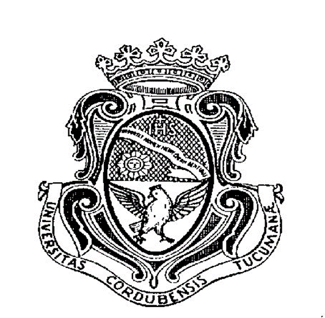
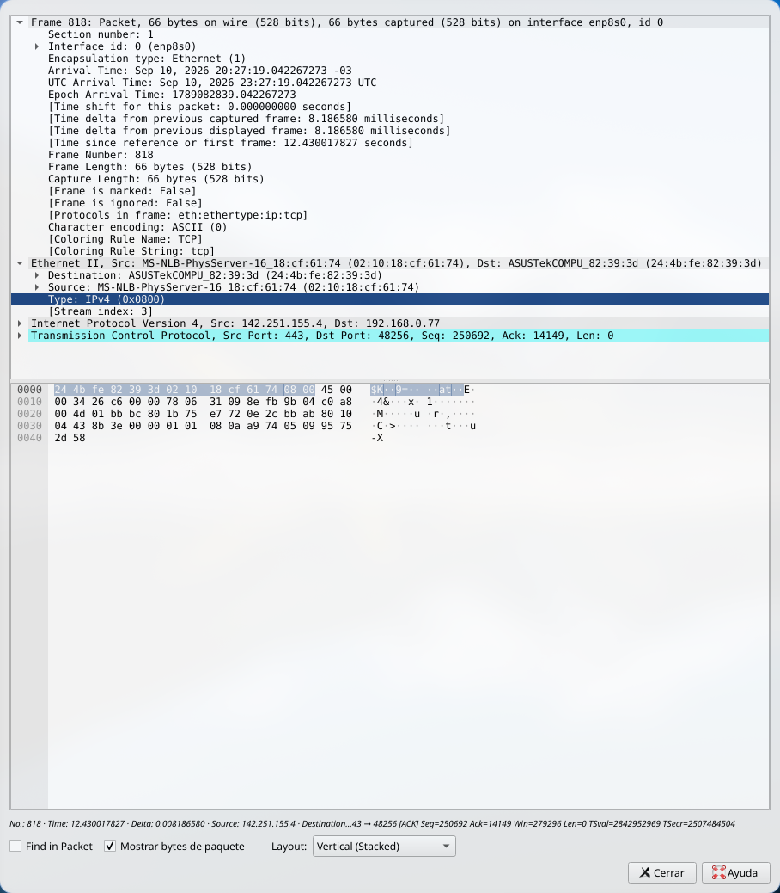
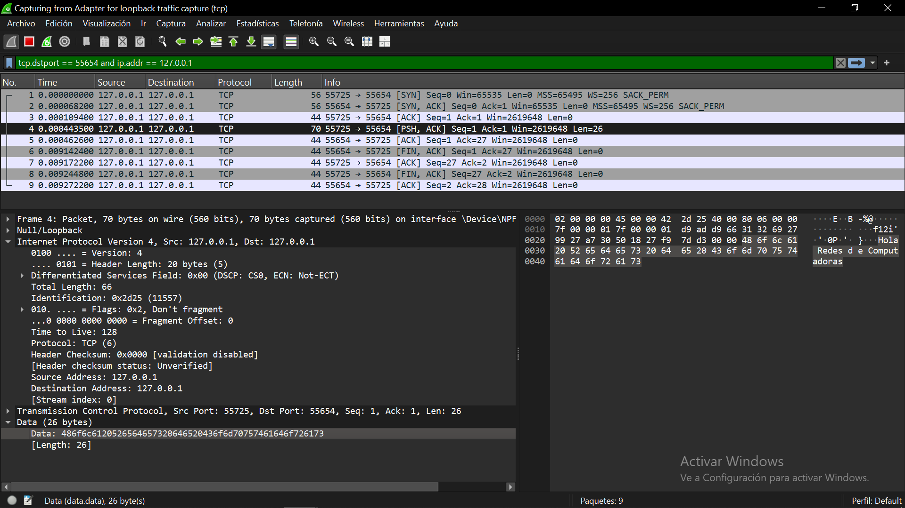
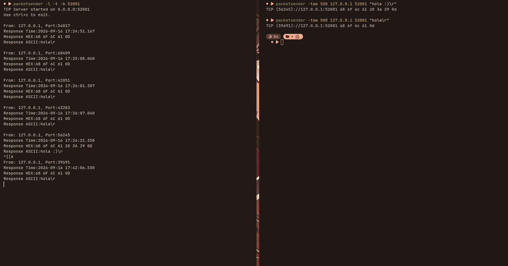
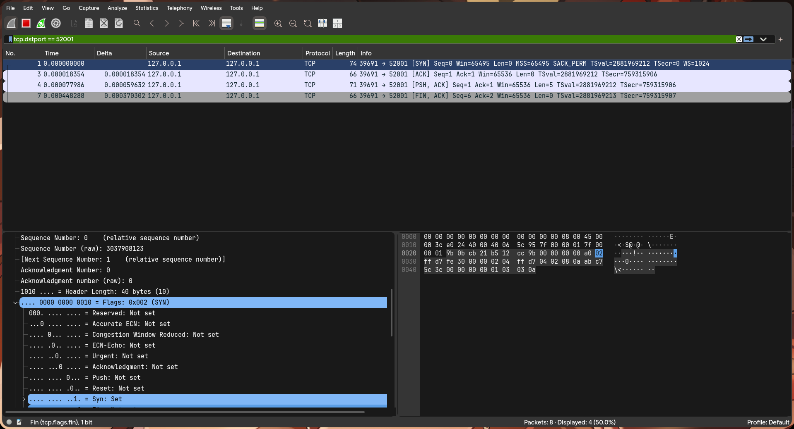

# Universidad Nacional de Córdoba
### Facultad de Ciencias Exactas, Físicas y Naturales



# Redes de Computadoras
## Trabajo Práctico de Teórico N.º 3:Enlace de Datos (2), Red (3) y Transporte (4)

| | |
|---|---|
| **Comisión** | ICOMP 24-3 |
| **Docente** | Oliva, Facundo |
| **Año** | 2026 |

**Alumnos:**
- Lamas, Matías Angel
- Torres Sosa, Candelaria
- Baiutti, Bruno Augusto
- Sanchez Oliveto, Juan Cruz
- Vazquez Zuloeta, Fabian
- Pinque, Emanuel Leandro
- Mayne, William Annesley

---

## Ítem 1 — Direccionamiento y trama Ethernet

### A) ¿Qué función cumple la capa de enlace dentro del modelo OSI? ¿Qué tipo de comunicación resuelve?

La capa de enlace de datos cumple la función de gestionar el direccionamiento físico y asegurar la transferencia confiable de información a través de un medio directo, como un segmento de red o un enlace punto a punto. Sus tareas principales incluyen el Framing (encapsular los paquetes de la capa de red en tramas agregándoles un encabezado y un tráiler), el direccionamiento físico dentro de la red local mediante direcciones únicas, y el control de acceso al medio para coordinar qué dispositivo transmite en cada momento evitando colisiones. Además, puede detectar o corregir errores mediante secuencias de verificación en la trama y regula el control de flujo para que un emisor rápido no sature al receptor.

Respecto a la comunicación que resuelve, opera de forma directa nodo a nodo dentro de la misma red local (LAN), dejando el enrutamiento entre redes externas a las capas superiores. Estructuralmente, se divide en dos subcapas: la LLC, que sirve de interfaz con la capa de red y maneja el control lógico, y la MAC, encargada de administrar la dirección física de la interfaz de red y el acceso al canal de transmisión.

### B) MAC vs. IP

Una dirección **MAC** (Media Access Control) es un identificador único de 48 bits grabado en la tarjeta de red (NIC) de un dispositivo; permite identificar de manera inequívoca a un equipo dentro de una red LAN.

La dirección **IP** (Internet Protocol), en cambio, es una dirección entre redes que permite ubicar a un destinatario de forma sencilla a través de Internet: es pública mientras dure la ruta, mientras que la MAC solo es visible dentro del segmento local.

### C) Estructura de la trama Ethernet

La trama Ethernet, transmitida en la capa de enlace de datos, mide entre 64 y 1518 bytes y contiene los siguientes campos de cabecera:

| Campo | Tamaño | Descripción |
|---|---|---|
| Preámbulo + SFD | 8 bytes | Ristra de 0s y 1s alternados que sincroniza el reloj del receptor |
| MAC destino | 6 bytes | — |
| MAC origen | 6 bytes | — |
| EtherType | 2 bytes | Identifica el protocolo de capa 3 encapsulado (IPv4 o IPv6) |
| Payload | 46–1500 bytes | Paquete IP real, con padding mínimo de 46 bytes |
| FCS | — | Frame Check Sequence: código de redundancia cíclica para detectar errores |

### D) El campo EtherType

Indica qué protocolo viaja en la capa superior:

| Valor | Protocolo |
|---|---|
| `0x0800` | IPv4 |
| `0x86DD` | IPv6 |
| `0x0806` | ARP |

---

## Ítem 2 — Análisis de una captura real (acceso a YouTube)

### A) Trama Ethernet II capturada

El paquete observado, correspondiente a tráfico TCP al acceder a YouTube, proviene de la IP pública `142.251.155.4`, perteneciente a los servidores de Google.

```
24 4b fe 82 39 3d  02 10 18 cf 61 74  08 00
```
*Cabecera Ethernet II en hexadecimal — MAC destino · MAC origen · EtherType.*

| | Dirección | Detalle |
|---|---|---|
| **MAC de origen** | `02:10:18:cf:61:74` | Gateway (router local). Wireshark resuelve su prefijo como MS-NLB (Microsoft Network Load Balancing). |
| **MAC de destino** | `24:4b:fe:82:39:3d` | Tarjeta de red de la computadora receptora. |

### D) EtherType observado

Los últimos dos bytes de la cabecera (`0x0800`) corresponden al campo EtherType, indicando que el protocolo de capa de red encapsulado es **IPv4**.



### B) Direcciones de capa 3 (IP)

| | Dirección | Detalle |
|---|---|---|
| **IP de origen** | `142.251.155.4` | Dirección pública de los servidores de Google (YouTube). |
| **IP de destino** | `192.168.0.77` | Dirección privada de la computadora receptora dentro de la red local. |

### C) MAC vs. IP en el recorrido

- **Dirección MAC (capa 2):** alcance exclusivo dentro de la LAN. Cambia en cada salto de red — la MAC de origen observada (`02:10:18:cf:61:74`) corresponde al gateway local, no al emisor final.
- **Dirección IP (capa 3):** identifica origen y destino finales a nivel global, y se mantiene constante a lo largo de toda la ruta a través de Internet.

---

## Ítem 3 — IP, Ethernet y TCP: responsabilidades por capa

### 1) Comparación entre capas

- **IP · Capa de red:** ofrece un servicio de *mejor esfuerzo* para entregar datagramas del host origen al destino, sin garantizar orden, ausencia de duplicados o integridad.
- **Ethernet · Capa de enlace:** transporta tramas entre dispositivos directamente conectados en el mismo segmento local. Detecta errores mediante CRC, pero no retransmite ni controla el flujo extremo a extremo a través de routers.
- **TCP · Capa de transporte:** resuelve el transporte extremo a extremo entre aplicaciones, agregando las garantías que faltan en las capas inferiores:
  - **Transferencia confiable de datos:** retransmite segmentos perdidos o dañados.
  - **Entrega ordenada:** usa números de secuencia para reordenar paquetes fuera de orden.
  - **Eliminación de duplicados:** descarta copias repetidas mediante números de secuencia.
  - **Control de flujo:** evita saturar el búfer del receptor mediante ventana deslizante.
  - **Control de congestión:** modula la velocidad de envío para no saturar routers intermedios.
  - **Multiplexación / desmultiplexación:** diferencia el tráfico de múltiples aplicaciones mediante números de puerto.

### B) Cabecera del segmento TCP

| Campo | Tamaño | Descripción |
|---|---|---|
| Puerto origen / destino | 16 bits c/u | Identifican los procesos emisor y receptor |
| Número de secuencia | 32 bits | Posición del primer byte de este segmento en el flujo de bytes |
| Número de ACK | 32 bits | Siguiente byte que el receptor espera recibir (confirmación acumulativa) |
| Data offset | 4 bits | Tamaño de la cabecera TCP en palabras de 32 bits |
| Window size | 16 bits | Bytes que el receptor está dispuesto a aceptar (control de flujo) |
| Checksum | 16 bits | Detección de errores en cabecera y datos |

**Flags de control:**

| Flag | Función |
|---|---|
| `SYN` | Inicia y sincroniza el establecimiento de la conexión |
| `ACK` | Indica que el campo Acknowledgment Number es válido |
| `FIN` | Solicita la finalización ordenada de la conexión |
| `RST` | Fuerza el reinicio inmediato de una conexión anormal o rechazada |
| `PSH` | Solicita entrega inmediata de datos a la aplicación |
| `URG` | Señala que el segmento contiene datos urgentes |

### C) Apertura y cierre de conexión

TCP utiliza un proceso de **tres vías** (Three-Way Handshake) para establecer la conexión, sincronizar los números de secuencia iniciales (ISN) y verificar la disponibilidad mutua. Para el cierre se usa un procedimiento de **cuatro vías** (Four-Way Handshake), ya que TCP es full-duplex y cada sentido debe cerrarse de forma independiente sin perder datos en tránsito.

**Three-Way Handshake (establecimiento):**

1. **`SYN`** Cliente → Servidor. Envía `Seq = x`, un número de secuencia inicial aleatorio.
2. **`SYN, ACK`** Servidor → Cliente. Confirma `Ack = x + 1` y envía su propio `Seq = y`.
3. **`ACK`** Cliente → Servidor. Confirma `Ack = y + 1`; este segmento ya puede llevar datos de aplicación.

**Four-Way Handshake (cierre):** cualquiera de los dos extremos puede iniciar el cierre de forma simétrica.

1. **`FIN`** Cliente → Servidor. `Seq = a`. Cierra el flujo de datos de su lado.
2. **`ACK`** Servidor → Cliente. `Ack = a + 1`. La conexión queda semicerrada (*half-close*).
3. **`FIN`** Servidor → Cliente. `Seq = b`, una vez que termina de enviar sus datos pendientes.
4. **`ACK`** Cliente → Servidor. `Ack = b + 1`. Entra en `TIME_WAIT` antes del cierre definitivo.

### D) Handshake capturado en Wireshark

```
[SYN]       55725 → 55654   SEQ = 0
[SYN, ACK]  55654 → 55725   SEQ = 0   ACK = 1
[ACK]       55725 → 55654   SEQ = 1   ACK = 1

# Paquete de datos
[PSH, ACK]  SEQ = 1   ACK = 1   LEN = 26
```

### E) Cierre capturado (Four-Way Handshake)

```
[FIN, ACK]  55654 → 55725   SEQ = 1    ACK = 27   # el servidor inicia el cierre
[ACK]       55725 → 55654   SEQ = 27   ACK = 2    # cliente confirma
[FIN, ACK]  55725 → 55654   SEQ = 27   ACK = 2    # cliente cierra su lado
[ACK]       55654 → 55725   SEQ = 2    ACK = 28   # servidor confirma el cierre
```



**Funciones de packetSender (linux)**


**Para levantar un server TCP**

```bash
packetsender -l -t -b 52001
```
*número a elección*

**Ahora se puede abrir otra terminal del client para enviar paquetes**



```bash
packetsender -taw 500 127.0.0.1 52001 "hola \r"
```

**Ahora vamos a aplicar el filtro a ver si logramos ver el handshake**



**y luego podemos ver nuestro mensaje en follow TCP**


### F) Conclusión

Como se pudo comprobar en la captura, resultó muy sencillo ver el contenido completo de un paquete viajando por la red —incluyendo el mensaje "Hola Redes de Computadoras" en texto plano— simplemente usando una herramienta de software gratuita y de uso libre como Wireshark, sin necesidad de conocimientos avanzados de programación ni de acceso privilegiado al sistema.

---

## Ítem 4 — Interacción con servidor remoto vía Packet Sender

**Parámetros de conexión:**

| Parámetro | Valor |
|---|---|
| IP de destino | `34.136.251.235` |
| Puerto de destino | `5555` |

**Registro de interacción:**

| Solicitud | Respuesta |
|---|---|
| `hola` | hola :) |
| `pika` | Server no conocer ese comando. Mi confundido. Probar otra cosa. |
| **`fernetmodulation`** | **seq: 7, payload: yo** |
| `hola` | hola :) |
| `ping` | pong |
| `h` | Server no conocer ese comando. Mi confundido. Probar otra cosa. |

> **Resultado clave:** al enviar el comando `fernetmodulation`, el servidor retornó la secuencia asociada al payload: **`seq: 7, payload: "yo"`**.

---

## Bibliografía

*Comunicaciones y Redes de Computadores — William Stallings, 7.ª edición*

1. Capítulo 3.1 — Conceptos y terminología
2. Capítulo 3.2 — Transmisión de datos analógicos y digitales
3. Capítulo 3.3 — Dificultades en la transmisión
4. Capítulo 3.4 — Capacidad del canal
5. Capítulo 4.1 — Medios de transmisión guiados
6. Capítulo 4.2 — Transmisión inalámbrica
7. Capítulo 4.3 — Propagación inalámbrica
8. Capítulo 4.4 — Transmisión en la trayectoria visual
9. Capítulo 5.1 — Datos digitales, señales digitales
10. Capítulo 5.2 — Datos digitales, señales analógicas
11. Capítulo 6.1 — Transmisión asincrónica y sincrónica
12. Capítulo 6.5 — Configuraciones de línea
