# Universidad Nacional de Córdoba
### Facultad de Ciencias Exactas, Físicas y Naturales


# Redes de Computadoras
## Trabajo Práctico de Teórico N.º 4: Capas de Acceso en Redes Locales, Protocolos y Fundamentos

| | |
|---|---|
| **Comisión** | ICOMP 24-3 |
| **Docente** | Oliva, Facundo |
| **Año** | 2026 |

**Alumnos:**
- Lamas, Matías Angel
- Torres Sosa, Candelaria
- Baiutti, Bruno Augusto
- Sanchez Oliveto, Juan Cruz
- Vazquez Zuloeta, Fabian
- Pinque, Emanuel Leandro
- Mayne, William Annesley

---

## Ítem 1 — Alcance de Redes y Virtualización

### A) Clasificación de las redes según su alcance

Las redes de computadoras se clasifican según su cobertura geográfica en distintos tipos. En la escala más reducida se encuentran las PAN (Personal Area Network), diseñadas para interconectar dispositivos de uso personal en un radio de pocos metros, por ejemplo Bluetooth.  
Subiendo en cobertura están las LAN (Local Area Network), las cuales son muy utilizadas en corporaciones o en el hogar para conectar equipos dentro de una misma oficina o edificio ya que ofrecen altas velocidades de transferencia y una baja latencia.  
Para abarcar áreas mayores existen las CAN (Campus Area Network), que tienen múltiples redes locales dentro de un predio delimitado como una universidad o complejo industrial, y las MAN (Metropolitan Area Network), que fueron creadas para cubrir la infraestructura de una ciudad o municipio entero uniendo sedes distantes.  
Por último, las WAN (Wide Area Network) abarcan países o continentes a través de infraestructuras públicas y privadas, donde Internet es el mayor ejemplo de esta categoría.

### B) ¿Qué es una vLAN? ¿Cómo se clasifican?

Una VLAN (Virtual Local Area Network) es una técnica de segmentación lógica que permite dividir una red física en varias redes lógicas independientes dentro del mismo switch o infraestructura física. Esto significa que los dispositivos conectados al mismo equipo físico pueden comportarse como si estuvieran en redes completamente aisladas, lo que mejora la seguridad, optimiza el tráfico broadcast y facilita la administración de la red sin necesidad de modificar el cableado. Las VLANs se clasifican  según la forma en que se asignan los puertos o dispositivos:las VLANs basadas en puerto vinculan un puerto físico del switch a una VLAN determinada; las VLANs dinámicas asignan la pertenencia de forma flexible utilizando parámetros como la dirección MAC del dispositivo, el tipo de protocolo de capa superior utilizado o credenciales de usuario (por medio de servidores como RADIUS).

### C) Protocolo IEEE 802.1Q y su relación con las VLANs

El estándar IEEE 802.1Q es el protocolo universal de red que define la arquitectura y el mecanismo formal para la implementación de VLANs en redes Ethernet. Su función clave es permitir que múltiples redes virtuales puedan viajar compartiendo un mismo enlace físico entre dos dispositivos de red (por ejemplo, el cable que conecta dos switches o un switch con un router). La relación con las VLANs es directa y estructural: sin este estándar de la industria, cada VLAN requeriría su propio cable físico independiente para comunicarse entre equipos, mientras que 802.1Q permite que el tráfico de decenas de VLANs distintas transite de forma multiplexada por un único enlace de interconexión (trunk) manteniendo la separación de cada red.

### D) En el contexto de los dos ítems anteriores ¿Qué es el Tagging?

En el marco de las VLANs y el estándar IEEE 802.1Q, el Tagging es el proceso mediante el cual un switch inserta un encabezado especial de 4 bytes dentro de la trama Ethernet antes de enviarla a través de un enlace trunk. Esta etiqueta incluye un campo fundamental llamado VLAN ID (Identificador de VLAN), el cual le informa al dispositivo receptor a qué red virtual específica pertenece esa trama para que no se mezcle con el tráfico de otras VLANs. Cuando la trama llega a su destino o a un puerto de acceso final, el switch receptor lee el tag, encamina el paquete a la VLAN correspondiente y elimina la etiqueta antes de entregar la trama al dispositivo final, asegurando que las computadoras reciban paquetes Ethernet estándar sin enterarse de la infraestructura virtual subyacente.  

---

# 2) Implementación de topología con VLANs en Packet Tracer

## Topología

La topología está formada por dos switches Cisco 2960 (sw1 y sw2) y dos laptops (PC-A y PC-B):

| Conexión | Origen | Destino | Tipo de cable |
|---|---|---|---|
| PC-A ↔ sw1 | PC-A FastEthernet0 | sw1 Fa0/6 | Directo (Straight-Through) |
| sw1 ↔ sw2 | sw1 Fa0/1 | sw2 Fa0/1 | Cruzado (Cross-Over) |
| sw2 ↔ PC-B | sw2 Fa0/18 | PC-B FastEthernet0 | Directo (Straight-Through) |
| PC-A ↔ sw1 | PC-A RS-232 | sw1 Console | Consola |
| PC-B ↔ sw2 | PC-B RS-232 | sw2 Console | Consola |

Los cables de consola permiten configurar cada switch desde la terminal de la laptop correspondiente (**Desktop → Terminal**).

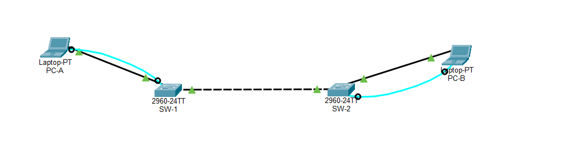

### Tabla de direccionamiento

| Dispositivo | Interfaz | Dirección IP | Máscara | Gateway |
|---|---|---|---|---|
| sw1 | VLAN 1 | 192.168.1.11 | 255.255.255.0 | N/A |
| sw2 | VLAN 1 | 192.168.1.12 | 255.255.255.0 | N/A |
| PC-A | NIC | 192.168.10.3 | 255.255.255.0 | 192.168.10.1 |
| PC-B | NIC | 192.168.10.4 | 255.255.255.0 | 192.168.10.1 |

Las IP de las PCs se configuraron en **Desktop → IP Configuration**, en modo estático.

## a) Nombre de los switches

Desde la terminal de cada PC se ingresó al switch correspondiente y se le asignó un nombre:

```
enable
configure terminal
hostname sw1
end
```

En sw2 se usó `hostname sw2`. Luego del cambio, el prompt pasa de `Switch#` a `sw1#` o `sw2#`.

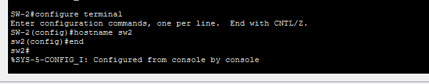

## b) Contraseñas privilegiada, de consola y vty

```
configure terminal
enable secret contrasena_exec_fm
line console 0
password contrasena_consola_fm
login
exit
line vty 0 15
password contrasena_vty_fm
login
exit
```

- **enable secret**: protege el acceso al modo privilegiado (`#`).
- **line console 0**: protege el acceso por el puerto de consola.
- **line vty 0 15**: protege el acceso remoto (Telnet/SSH) a través de las 16 líneas virtuales.
- **login**: indica que se pida la contraseña al ingresar por esa línea.

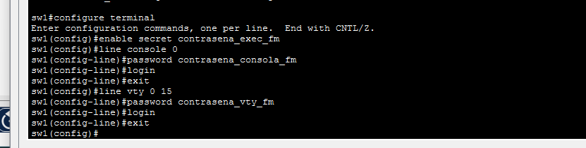

## c) Encriptación de contraseñas

```
service password-encryption
```

Este comando cifra las contraseñas que están guardadas en texto plano (consola y vty). En `show running-config` pasan a verse como `password 7 ...`. La contraseña de `enable secret` ya se almacena cifrada por defecto (`secret 5 ...`).

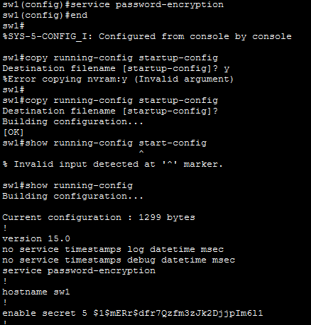

## d) IP de administración en la VLAN 1

```
interface vlan 1
ip address 192.168.1.11 255.255.255.0
no shutdown
exit
```

En sw2 se usó la IP `192.168.1.12`. Un switch de capa 2 no asigna IP a sus puertos físicos: se configura sobre una interfaz virtual (SVI) de una VLAN, y esa IP sirve para administrar el equipo de forma remota. El `no shutdown` es necesario porque la interfaz viene deshabilitada.

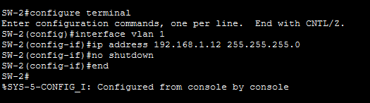

## e) Deshabilitar interfaces no utilizadas

Se apagaron todos los puertos que no tienen dispositivos conectados.

En sw1, que usa Fa0/1 y Fa0/6:

```
interface range fa0/2-5, fa0/7-24, gi0/1-2
shutdown
```

En sw2, que usa Fa0/1 y Fa0/18:

```
interface range fa0/2-17, fa0/19-24, gi0/1-2
shutdown
```

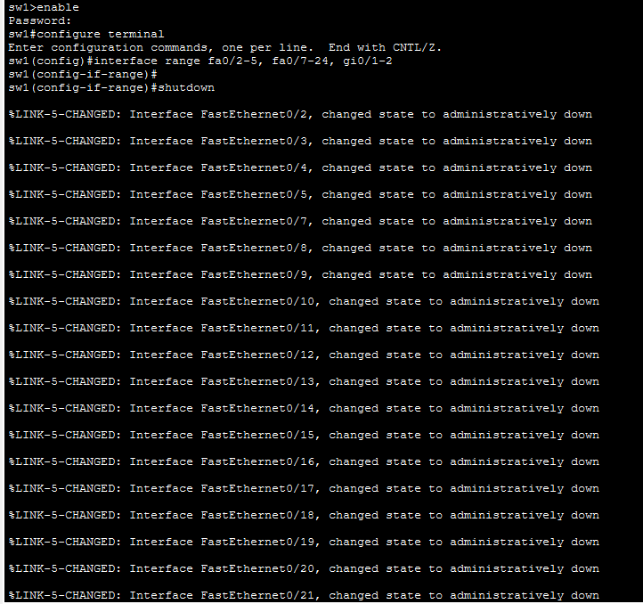

## f) Guardado de la configuración

```
write memory
```

Copia la configuración en ejecución (*running-config*, almacenada en RAM) a la configuración de arranque (*startup-config*, almacenada en NVRAM), para que los cambios se conserven si el switch se reinicia.

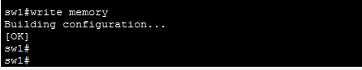

## g) Prueba de conectividad entre las PCs

Desde PC-A (**Desktop → Command Prompt**):

```
ping 192.168.10.4
```

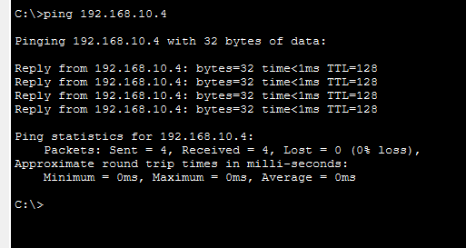

El ping es exitoso: ambas PCs están en la misma red (192.168.10.0/24) y todos los puertos de los switches pertenecen a la misma VLAN (VLAN 1), así que forman un único dominio de broadcast.


## h) Creación de VLANs

En ambos switches:

```
configure terminal
vlan 10
name Laboratorio
vlan 20
name Bar
vlan 99
name Management
end
```

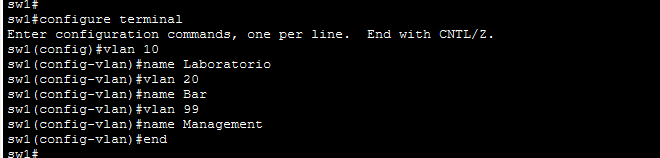

## i) Lista de VLANs y VLAN por defecto

```
show vlan brief
```

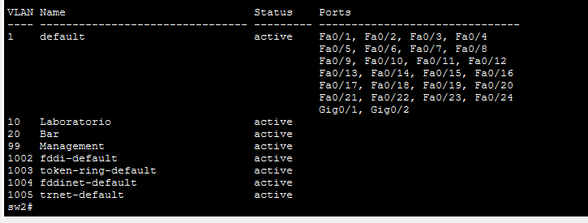

La **VLAN por defecto es la VLAN 1** (*default*). De fábrica todos los puertos del switch pertenecen a ella y no se puede eliminar ni renombrar. Las VLANs 10, 20 y 99 aparecen creadas,sin puertos asignados. Las VLANs 1002 a 1005 vienen reservadas para tecnologías antiguas (FDDI y Token Ring).

## j) Asignación de PC-A a la VLAN Laboratorio

En sw1:

```
interface f0/6
switchport mode access
switchport access vlan 10
```

El puerto Fa0/6 queda como puerto de acceso de la VLAN 10. Todo el tráfico de PC-A pertenece ahora a esa VLAN.

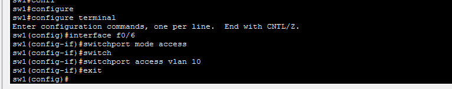

## k) Traslado de la IP de administración a la VLAN 99

En sw1:

```
interface vlan 1
no ip address
interface vlan 99
ip address 192.168.1.11 255.255.255.0
no shutdown
end
```

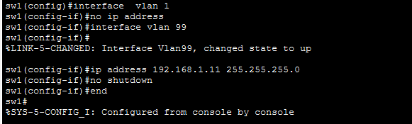

## l) Verificación del estado de VLANs e interfaces

En sw1:

```
show vlan brief
show ip interface brief
```

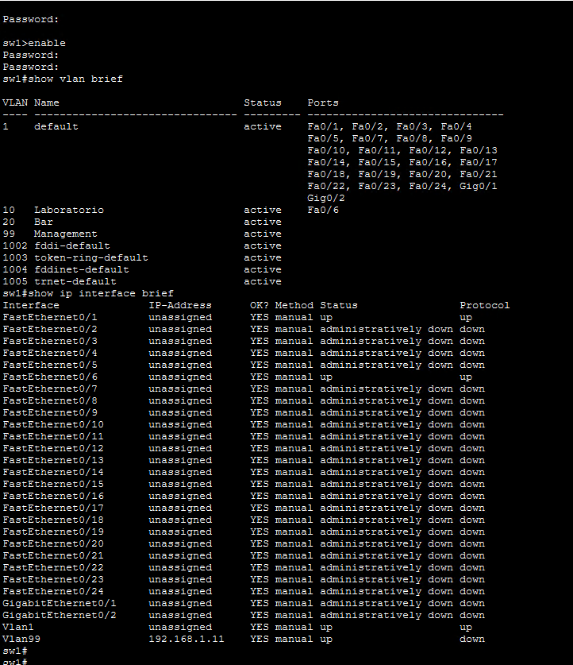

- Con `show vlan brief` se observa que el puerto **Fa0/6**, donde está conectada PC-A, ahora pertenece a la **VLAN 10 (Laboratorio)**. El resto de los puertos, incluido **Fa0/1** (el enlace hacia sw2), siguen perteneciendo a la **VLAN 1**. Las VLANs 20 (Bar) y 99 (Management) están activas, pero no tienen puertos asignados.
- Con `show ip interface brief` se observa que solo **Fa0/1 y Fa0/6** están activas (**up/up**), porque son las únicas con un dispositivo conectado. Las demás interfaces figuran como **administratively down**, porque las deshabilitamos manualmente en el paso e).
- La interfaz **Vlan1** quedó sin dirección IP (*unassigned*). Pero sigue **up/up**, porque todavía hay un puerto activo en la VLAN 1 (Fa0/1).
- La interfaz **Vlan99** tiene la IP **192.168.1.11**, pero su estado es **up/down**. La interfaz está habilitada administrativamente (*Status up*), pero su protocolo está caído porque no hay ningún puerto activo que pertenezca a la VLAN 99, así que no tiene por dónde enviar ni recibir tráfico.

## m) Configuración equivalente en sw2

En sw2:

```
configure terminal
interface f0/18
switchport mode access
switchport access vlan 10
exit
interface vlan 1
no ip address
interface vlan 99
ip address 192.168.1.12 255.255.255.0
no shutdown
end
write memory
show vlan brief
```

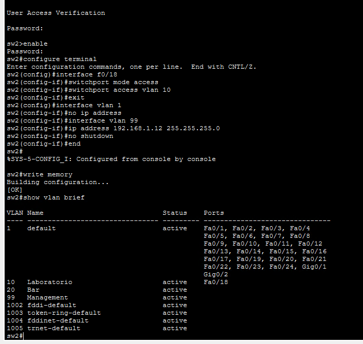

La salida de `show vlan brief` muestra que el puerto **Fa0/18**, donde está conectada PC-B, pertenece a la **VLAN 10 (Laboratorio)**. El resto de los puertos, incluido Fa0/1, siguen en la VLAN 1. 
El mensaje `[OK]` de `write memory` confirma que la configuración se guardó en la NVRAM.

La configuración de sw2 queda simétrica a la de sw1. Cada PC está en la VLAN 10, y la IP de administración de cada switch (192.168.1.12 en este caso) está en la VLAN 99. Igual que en sw1, su interfaz Vlan99 también queda en estado **up/down**.

## n) Verificación de conectividad

Desde PC-A:

```
ping 192.168.10.4
```

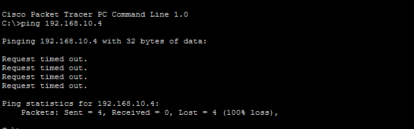

Desde la consola de sw1:

```
ping 192.168.1.12
```

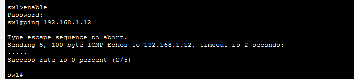

Ambos pings **fallan**:

- **PC-A → PC-B:** los 4 paquetes terminan en *Request timed out* (**100% de pérdida**).
- **sw1 → sw2:** los 5 intentos muestran `.`, que en Cisco IOS indica que no llegó respuesta (**Success rate 0 percent, 0/5**).

En la parte g), las PCs sí se comunicaban. Los dos pares de dispositivos están en la misma VLAN y en la misma red IP (VLAN 10 con 192.168.10.0/24, y VLAN 99 con 192.168.1.0/24), así que la causa está en el enlace entre los switches.

- El enlace **sw1 Fa0/1 ↔ sw2 Fa0/1** sigue configurado como puerto de acceso de la **VLAN 1**, por lo que solo transporta tráfico de esa VLAN.
- **PC-A y PC-B** están en la **VLAN 10**. Cada switch solo reenvía las tramas de la VLAN 10 por puertos que pertenecen a esa VLAN y en cada switch el único es el de la propia PC. El tráfico nunca llega al otro switch.
- La administración de los switches está en la **VLAN 99**, que no tiene ningún puerto asignado. Por eso **Vlan99** figura como **up/down** en los dos  switches y el ping entre ellos no puede salir.

Esto muestra una propiedad fundamental de las VLANs **segmentan la red en capa 2**. Aunque exista un cable físico entre los switches, dos dispositivos de la misma VLAN solo se comunican si existe un camino que transporte esa VLAN.

---

## Bibliografía

*Comunicaciones y Redes de Computadores — William Stallings, 7.ª edición*

1. Capítulo 3.1 — Conceptos y terminología
2. Capítulo 3.2 — Transmisión de datos analógicos y digitales
3. Capítulo 3.3 — Dificultades en la transmisión
4. Capítulo 3.4 — Capacidad del canal
5. Capítulo 4.1 — Medios de transmisión guiados
6. Capítulo 4.2 — Transmisión inalámbrica
7. Capítulo 4.3 — Propagación inalámbrica
8. Capítulo 4.4 — Transmisión en la trayectoria visual
9. Capítulo 5.1 — Datos digitales, señales digitales
10. Capítulo 5.2 — Datos digitales, señales analógicas
11. Capítulo 6.1 — Transmisión asincrónica y sincrónica
12. Capítulo 6.5 — Configuraciones de línea
