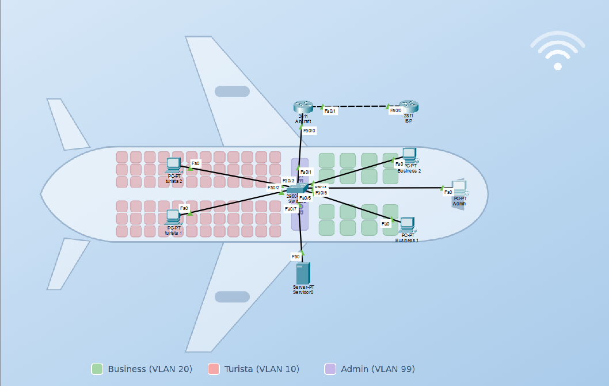
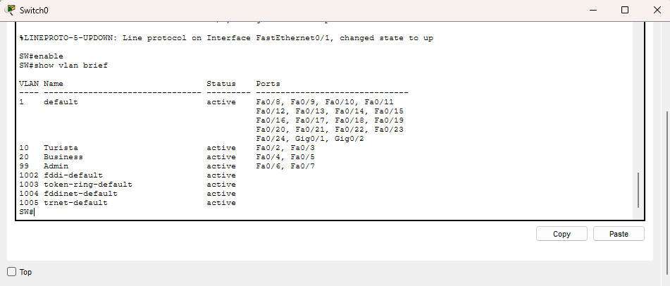
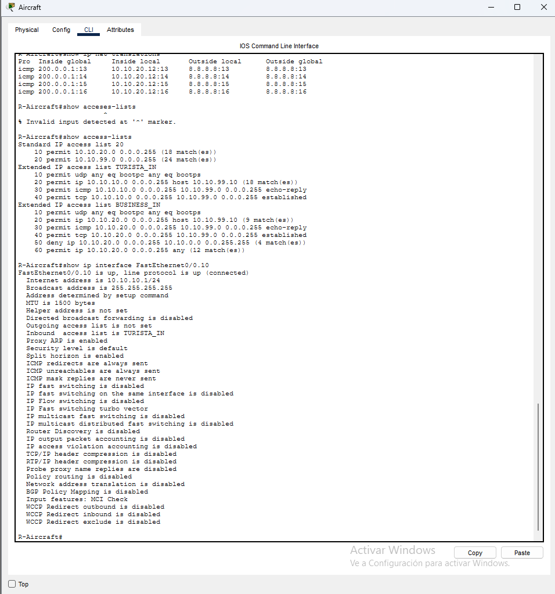
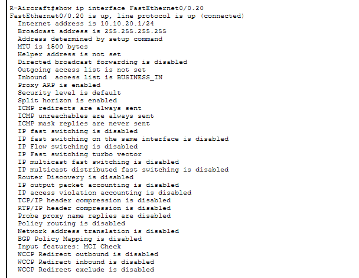
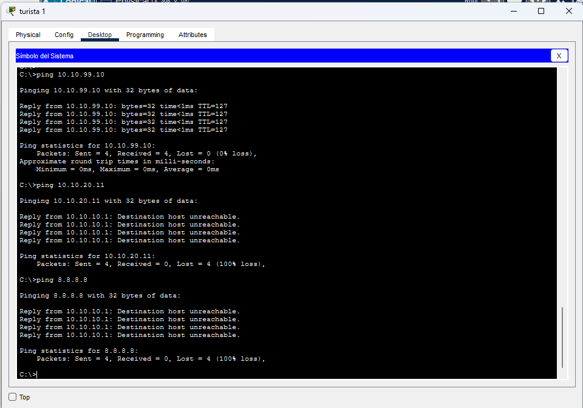
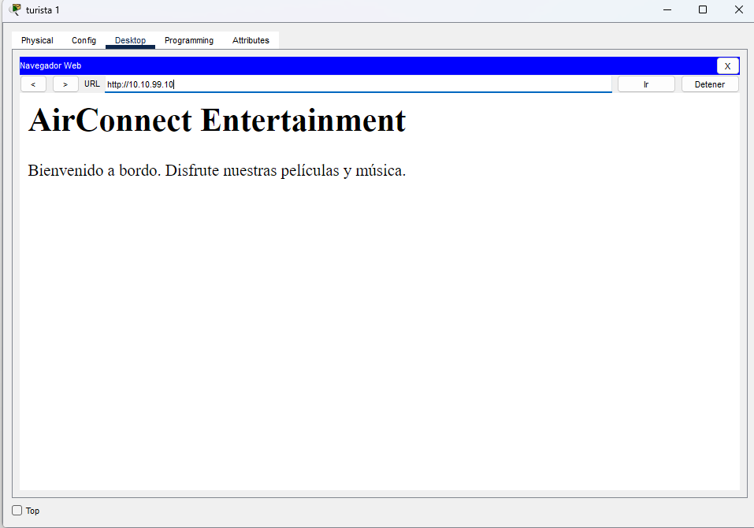
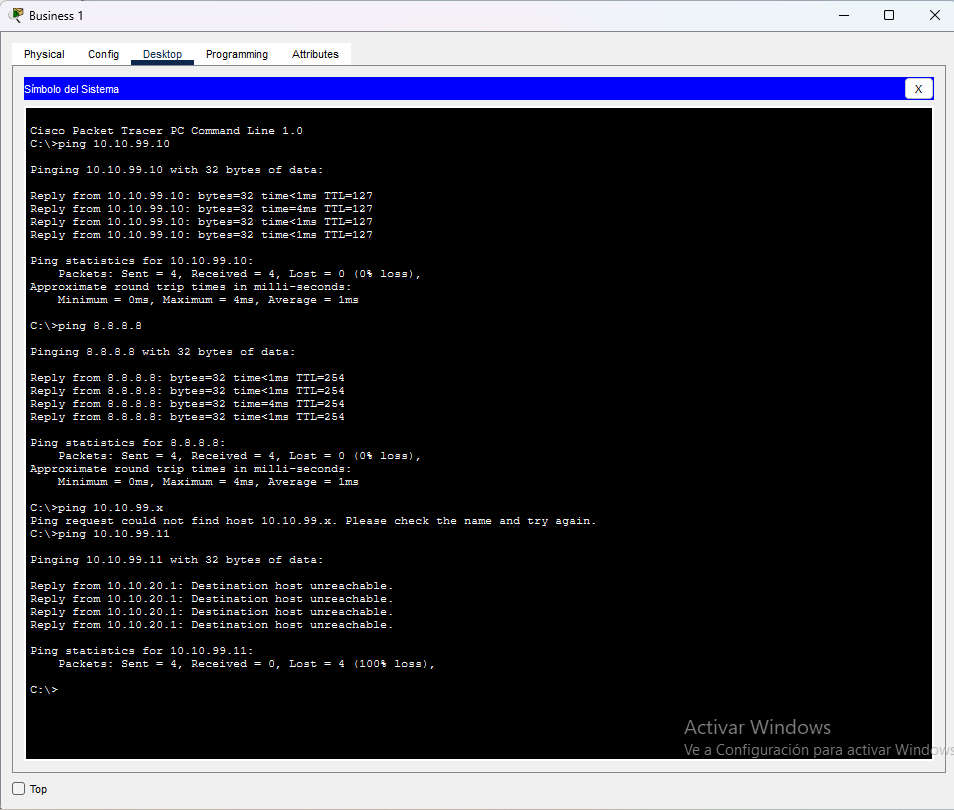
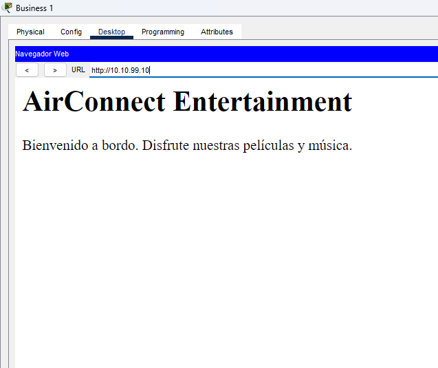
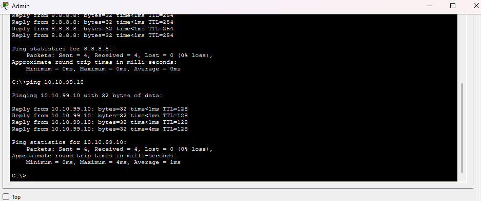
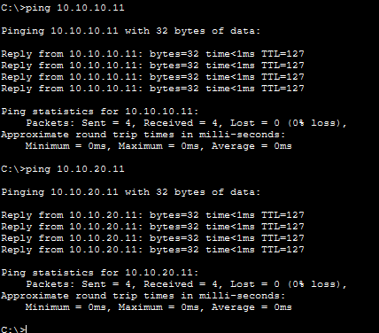

# Universidad Nacional de Córdoba
### Facultad de Ciencias Exactas, Físicas y Naturales


# Redes de Computadoras
## Trabajo Práctico de Teórico N.º 4: Capas de Acceso en Redes Locales, Protocolos y Fundamentos

| | |
|---|---|
| **Comisión** | ICOMP 24-3 |
| **Docente** | Oliva, Facundo |
| **Año** | 2026 |

**Alumnos:**
- Lamas, Matías Angel
- Torres Sosa, Candelaria
- Baiutti, Bruno Augusto
- Sanchez Oliveto, Juan Cruz
- Vazquez Zuloeta, Fabian
- Pinque, Emanuel Leandro
- Mayne, William Annesley

---

## Ítem 1 — Alcance de Redes y Virtualización

### A) Clasificación de las redes según su alcance

Las redes de computadoras se clasifican según su cobertura geográfica en distintos tipos. En la escala más reducida se encuentran las PAN (Personal Area Network), diseñadas para interconectar dispositivos de uso personal en un radio de pocos metros, por ejemplo Bluetooth.  
Subiendo en cobertura están las LAN (Local Area Network), las cuales son muy utilizadas en corporaciones o en el hogar para conectar equipos dentro de una misma oficina o edificio ya que ofrecen altas velocidades de transferencia y una baja latencia.  
Para abarcar áreas mayores existen las CAN (Campus Area Network), que tienen múltiples redes locales dentro de un predio delimitado como una universidad o complejo industrial, y las MAN (Metropolitan Area Network), que fueron creadas para cubrir la infraestructura de una ciudad o municipio entero uniendo sedes distantes.  
Por último, las WAN (Wide Area Network) abarcan países o continentes a través de infraestructuras públicas y privadas, donde Internet es el mayor ejemplo de esta categoría.

### B) ¿Qué es una vLAN? ¿Cómo se clasifican?

Una VLAN (Virtual Local Area Network) es una técnica de segmentación lógica que permite dividir una red física en varias redes lógicas independientes dentro del mismo switch o infraestructura física. Esto significa que los dispositivos conectados al mismo equipo físico pueden comportarse como si estuvieran en redes completamente aisladas, lo que mejora la seguridad, optimiza el tráfico broadcast y facilita la administración de la red sin necesidad de modificar el cableado. Las VLANs se clasifican  según la forma en que se asignan los puertos o dispositivos:las VLANs basadas en puerto vinculan un puerto físico del switch a una VLAN determinada; las VLANs dinámicas asignan la pertenencia de forma flexible utilizando parámetros como la dirección MAC del dispositivo, el tipo de protocolo de capa superior utilizado o credenciales de usuario (por medio de servidores como RADIUS).

### C) Protocolo IEEE 802.1Q y su relación con las VLANs

El estándar IEEE 802.1Q es el protocolo universal de red que define la arquitectura y el mecanismo formal para la implementación de VLANs en redes Ethernet. Su función clave es permitir que múltiples redes virtuales puedan viajar compartiendo un mismo enlace físico entre dos dispositivos de red (por ejemplo, el cable que conecta dos switches o un switch con un router). La relación con las VLANs es directa y estructural: sin este estándar de la industria, cada VLAN requeriría su propio cable físico independiente para comunicarse entre equipos, mientras que 802.1Q permite que el tráfico de decenas de VLANs distintas transite de forma multiplexada por un único enlace de interconexión (trunk) manteniendo la separación de cada red.

### D) En el contexto de los dos ítems anteriores ¿Qué es el Tagging?

En el marco de las VLANs y el estándar IEEE 802.1Q, el Tagging es el proceso mediante el cual un switch inserta un encabezado especial de 4 bytes dentro de la trama Ethernet antes de enviarla a través de un enlace trunk. Esta etiqueta incluye un campo fundamental llamado VLAN ID (Identificador de VLAN), el cual le informa al dispositivo receptor a qué red virtual específica pertenece esa trama para que no se mezcle con el tráfico de otras VLANs. Cuando la trama llega a su destino o a un puerto de acceso final, el switch receptor lee el tag, encamina el paquete a la VLAN correspondiente y elimina la etiqueta antes de entregar la trama al dispositivo final, asegurando que las computadoras reciban paquetes Ethernet estándar sin enterarse de la infraestructura virtual subyacente.  

---

# 2) Implementación de topología con VLANs en Packet Tracer

## Topología

La topología está formada por dos switches Cisco 2960 (sw1 y sw2) y dos laptops (PC-A y PC-B):

| Conexión | Origen | Destino | Tipo de cable |
|---|---|---|---|
| PC-A ↔ sw1 | PC-A FastEthernet0 | sw1 Fa0/6 | Directo (Straight-Through) |
| sw1 ↔ sw2 | sw1 Fa0/1 | sw2 Fa0/1 | Cruzado (Cross-Over) |
| sw2 ↔ PC-B | sw2 Fa0/18 | PC-B FastEthernet0 | Directo (Straight-Through) |
| PC-A ↔ sw1 | PC-A RS-232 | sw1 Console | Consola |
| PC-B ↔ sw2 | PC-B RS-232 | sw2 Console | Consola |

Los cables de consola permiten configurar cada switch desde la terminal de la laptop correspondiente (**Desktop → Terminal**).


### Tabla de direccionamiento

| Dispositivo | Interfaz | Dirección IP | Máscara | Gateway |
|---|---|---|---|---|
| sw1 | VLAN 1 | 192.168.1.11 | 255.255.255.0 | N/A |
| sw2 | VLAN 1 | 192.168.1.12 | 255.255.255.0 | N/A |
| PC-A | NIC | 192.168.10.3 | 255.255.255.0 | 192.168.10.1 |
| PC-B | NIC | 192.168.10.4 | 255.255.255.0 | 192.168.10.1 |

Las IP de las PCs se configuraron en **Desktop → IP Configuration**, en modo estático.

## a) Nombre de los switches

Desde la terminal de cada PC se ingresó al switch correspondiente y se le asignó un nombre:

```
enable
configure terminal
hostname sw1
end
```

En sw2 se usó `hostname sw2`. Luego del cambio, el prompt pasa de `Switch#` a `sw1#` o `sw2#`.


## b) Contraseñas privilegiada, de consola y vty

```
configure terminal
enable secret contrasena_exec_fm
line console 0
password contrasena_consola_fm
login
exit
line vty 0 15
password contrasena_vty_fm
login
exit
```

- **enable secret**: protege el acceso al modo privilegiado (`#`).
- **line console 0**: protege el acceso por el puerto de consola.
- **line vty 0 15**: protege el acceso remoto (Telnet/SSH) a través de las 16 líneas virtuales.
- **login**: indica que se pida la contraseña al ingresar por esa línea.


## c) Encriptación de contraseñas

```
service password-encryption
```

Este comando cifra las contraseñas que están guardadas en texto plano (consola y vty). En `show running-config` pasan a verse como `password 7 ...`. La contraseña de `enable secret` ya se almacena cifrada por defecto (`secret 5 ...`).


## d) IP de administración en la VLAN 1

```
interface vlan 1
ip address 192.168.1.11 255.255.255.0
no shutdown
exit
```

En sw2 se usó la IP `192.168.1.12`. Un switch de capa 2 no asigna IP a sus puertos físicos: se configura sobre una interfaz virtual (SVI) de una VLAN, y esa IP sirve para administrar el equipo de forma remota. El `no shutdown` es necesario porque la interfaz viene deshabilitada.


## e) Deshabilitar interfaces no utilizadas

Se apagaron todos los puertos que no tienen dispositivos conectados.

En sw1, que usa Fa0/1 y Fa0/6:

```
interface range fa0/2-5, fa0/7-24, gi0/1-2
shutdown
```

En sw2, que usa Fa0/1 y Fa0/18:

```
interface range fa0/2-17, fa0/19-24, gi0/1-2
shutdown
```


## f) Guardado de la configuración

```
write memory
```

Copia la configuración en ejecución (*running-config*, almacenada en RAM) a la configuración de arranque (*startup-config*, almacenada en NVRAM), para que los cambios se conserven si el switch se reinicia.


## g) Prueba de conectividad entre las PCs

Desde PC-A (**Desktop → Command Prompt**):

```
ping 192.168.10.4
```


El ping es exitoso: ambas PCs están en la misma red (192.168.10.0/24) y todos los puertos de los switches pertenecen a la misma VLAN (VLAN 1), así que forman un único dominio de broadcast.


## h) Creación de VLANs

En ambos switches:

```
configure terminal
vlan 10
name Laboratorio
vlan 20
name Bar
vlan 99
name Management
end
```


## i) Lista de VLANs y VLAN por defecto

```
show vlan brief
```


La **VLAN por defecto es la VLAN 1** (*default*). De fábrica todos los puertos del switch pertenecen a ella y no se puede eliminar ni renombrar. Las VLANs 10, 20 y 99 aparecen creadas,sin puertos asignados. Las VLANs 1002 a 1005 vienen reservadas para tecnologías antiguas (FDDI y Token Ring).

## j) Asignación de PC-A a la VLAN Laboratorio

En sw1:

```
interface f0/6
switchport mode access
switchport access vlan 10
```

El puerto Fa0/6 queda como puerto de acceso de la VLAN 10. Todo el tráfico de PC-A pertenece ahora a esa VLAN.


## k) Traslado de la IP de administración a la VLAN 99

En sw1:

```
interface vlan 1
no ip address
interface vlan 99
ip address 192.168.1.11 255.255.255.0
no shutdown
end
```


## l) Verificación del estado de VLANs e interfaces

En sw1:

```
show vlan brief
show ip interface brief
```


- Con `show vlan brief` se observa que el puerto **Fa0/6**, donde está conectada PC-A, ahora pertenece a la **VLAN 10 (Laboratorio)**. El resto de los puertos, incluido **Fa0/1** (el enlace hacia sw2), siguen perteneciendo a la **VLAN 1**. Las VLANs 20 (Bar) y 99 (Management) están activas, pero no tienen puertos asignados.
- Con `show ip interface brief` se observa que solo **Fa0/1 y Fa0/6** están activas (**up/up**), porque son las únicas con un dispositivo conectado. Las demás interfaces figuran como **administratively down**, porque las deshabilitamos manualmente en el paso e).
- La interfaz **Vlan1** quedó sin dirección IP (*unassigned*). Pero sigue **up/up**, porque todavía hay un puerto activo en la VLAN 1 (Fa0/1).
- La interfaz **Vlan99** tiene la IP **192.168.1.11**, pero su estado es **up/down**. La interfaz está habilitada administrativamente (*Status up*), pero su protocolo está caído porque no hay ningún puerto activo que pertenezca a la VLAN 99, así que no tiene por dónde enviar ni recibir tráfico.

## m) Configuración equivalente en sw2

En sw2:

```
configure terminal
interface f0/18
switchport mode access
switchport access vlan 10
exit
interface vlan 1
no ip address
interface vlan 99
ip address 192.168.1.12 255.255.255.0
no shutdown
end
write memory
show vlan brief
```


La salida de `show vlan brief` muestra que el puerto **Fa0/18**, donde está conectada PC-B, pertenece a la **VLAN 10 (Laboratorio)**. El resto de los puertos, incluido Fa0/1, siguen en la VLAN 1. 
El mensaje `[OK]` de `write memory` confirma que la configuración se guardó en la NVRAM.

La configuración de sw2 queda simétrica a la de sw1. Cada PC está en la VLAN 10, y la IP de administración de cada switch (192.168.1.12 en este caso) está en la VLAN 99. Igual que en sw1, su interfaz Vlan99 también queda en estado **up/down**.

## n) Verificación de conectividad

Desde PC-A:

```
ping 192.168.10.4
```


Desde la consola de sw1:

```
ping 192.168.1.12
```


Ambos pings **fallan**:

- **PC-A → PC-B:** los 4 paquetes terminan en *Request timed out* (**100% de pérdida**).
- **sw1 → sw2:** los 5 intentos muestran `.`, que en Cisco IOS indica que no llegó respuesta (**Success rate 0 percent, 0/5**).

En la parte g), las PCs sí se comunicaban. Los dos pares de dispositivos están en la misma VLAN y en la misma red IP (VLAN 10 con 192.168.10.0/24, y VLAN 99 con 192.168.1.0/24), así que la causa está en el enlace entre los switches.

- El enlace **sw1 Fa0/1 ↔ sw2 Fa0/1** sigue configurado como puerto de acceso de la **VLAN 1**, por lo que solo transporta tráfico de esa VLAN.
- **PC-A y PC-B** están en la **VLAN 10**. Cada switch solo reenvía las tramas de la VLAN 10 por puertos que pertenecen a esa VLAN y en cada switch el único es el de la propia PC. El tráfico nunca llega al otro switch.
- La administración de los switches está en la **VLAN 99**, que no tiene ningún puerto asignado. Por eso **Vlan99** figura como **up/down** en los dos  switches y el ping entre ellos no puede salir.

Esto muestra una propiedad fundamental de las VLANs **segmentan la red en capa 2**. Aunque exista un cable físico entre los switches, dos dispositivos de la misma VLAN solo se comunican si existe un camino que transporte esa VLAN.


---
# 3) Red LAN a bordo de una aeronave (VLAN, NAT y ACL)

Para este punto armamos en Packet Tracer la red de un avión. La idea es dividir a los usuarios en tres grupos con permisos distintos, usando VLANs para separarlos, NAT para la salida a Internet y ACL para controlar quién puede llegar adónde:

- **Turista (VLAN 10):** solo puede acceder al servidor de entretenimiento.
- **Business (VLAN 20):** accede al servidor y a Internet.
- **Administración (VLAN 99):** acceso total.

## Topología

La red tiene un router (R-Aircraft, un Cisco 2811), un switch 2960, otro router 2811 que hace de ISP, dos PCs Turista, dos PCs Business, una PC Admin y un servidor. Como fondo usamos un dibujo de un avión y pintamos cada zona con su clase (rojo: Turista, verde: Business, violeta: Admin).



| Conexión | Origen | Destino | Cable |
|---|---|---|---|
| Router ↔ Switch | R-Aircraft Fa0/0 | SW Fa0/1 | Directo |
| Router ↔ ISP | R-Aircraft Fa0/1 | ISP Fa0/0 | Cruzado |
| Turistas ↔ Switch | PCs Turista Fa0 | SW Fa0/2 y Fa0/3 | Directo |
| Business ↔ Switch | PCs Business Fa0 | SW Fa0/4 y Fa0/5 | Directo |
| Admin ↔ Switch | PC Admin Fa0 | SW Fa0/6 | Directo |
| Servidor ↔ Switch | Servidor Fa0 | SW Fa0/7 | Directo |

### Direccionamiento

| VLAN | Nombre | Red IP | Gateway | Acceso |
|---|---|---|---|---|
| 10 | Turista | 10.10.10.0/24 | 10.10.10.1 | Solo servidor |
| 20 | Business | 10.10.20.0/24 | 10.10.20.1 | Servidor + Internet |
| 99 | Administración | 10.10.99.0/24 | 10.10.99.1 | Acceso total |
| — | Enlace ISP | 200.0.0.0/30 | 200.0.0.1 (R-Aircraft) y 200.0.0.2 (ISP) | — |

El servidor está en la VLAN 99 con IP fija `10.10.99.10/24` y gateway `10.10.99.1`. Las PCs toman su IP por DHCP del router, que tiene un pool por cada VLAN. Para simular Internet, al router ISP le pusimos una interfaz *loopback* con la IP `8.8.8.8`, que contesta los pings.

## Configuración del switch (SW)

Creamos las tres VLANs, dejamos el puerto hacia el router como troncal y asignamos cada puerto a la VLAN de su clase:

```
enable
configure terminal

vlan 10
 name Turista
vlan 20
 name Business
vlan 99
 name Admin

interface FastEthernet0/1
 switchport mode trunk

interface range FastEthernet0/2 - 3
 switchport mode access
 switchport access vlan 10

interface range FastEthernet0/4 - 5
 switchport mode access
 switchport access vlan 20

interface FastEthernet0/6
 switchport mode access
 switchport access vlan 99

interface FastEthernet0/7
 switchport mode access
 switchport access vlan 99
end
write memory
```

Para verificarlo usamos `show vlan brief`:



Ahí se ven las VLANs 10, 20 y 99 activas, con Fa0/2-3 en la 10, Fa0/4-5 en la 20 y Fa0/6-7 en la 99. Fa0/1 no figura en ninguna porque es troncal y lleva todas las VLANs etiquetadas con 802.1Q. Los puertos que no usamos quedan en la VLAN 1.

## Configuración del router (R-Aircraft)

### Subinterfaces

El router tiene un solo cable hacia el switch (Fa0/0), así que creamos una subinterfaz por cada VLAN con encapsulación 802.1Q. Cada una hace de gateway de su red y es la que permite que las VLANs se comuniquen entre sí (esto se conoce como *router-on-a-stick*):

```
interface FastEthernet0/0
 no shutdown

interface FastEthernet0/0.10
 encapsulation dot1Q 10
 ip address 10.10.10.1 255.255.255.0

interface FastEthernet0/0.20
 encapsulation dot1Q 20
 ip address 10.10.20.1 255.255.255.0

interface FastEthernet0/0.99
 encapsulation dot1Q 99
 ip address 10.10.99.1 255.255.255.0

interface FastEthernet0/1
 ip address 200.0.0.1 255.255.255.252
 no shutdown
```

### DHCP

Un pool por clase. Excluimos las primeras 10 direcciones de cada red para que queden libres para el gateway y para equipos con IP fija, como el servidor:

```
ip dhcp excluded-address 10.10.10.1 10.10.10.10
ip dhcp excluded-address 10.10.20.1 10.10.20.10
ip dhcp excluded-address 10.10.99.1 10.10.99.10

ip dhcp pool Turista
 network 10.10.10.0 255.255.255.0
 default-router 10.10.10.1
 dns-server 10.10.100.10

ip dhcp pool Business
 network 10.10.20.0 255.255.255.0
 default-router 10.10.20.1
 dns-server 8.8.8.8

ip dhcp pool Admin
 network 10.10.99.0 255.255.255.0
 default-router 10.10.99.1
 dns-server 8.8.8.8
```

### NAT y ruta por defecto

Con NAT con sobrecarga (PAT) las IPs privadas de Business y Admin salen a Internet con la IP de la interfaz hacia el ISP (`200.0.0.1`). Turista no tiene NAT, porque no debe salir a Internet. La ruta por defecto manda todo lo que el router no conoce hacia el ISP:

```
access-list 20 permit 10.10.20.0 0.0.0.255
access-list 20 permit 10.10.99.0 0.0.0.255
ip nat inside source list 20 interface FastEthernet0/1 overload

interface FastEthernet0/0.20
 ip nat inside
interface FastEthernet0/0.99
 ip nat inside
interface FastEthernet0/1
 ip nat outside

ip route 0.0.0.0 0.0.0.0 200.0.0.2
```

Con `show ip route` comprobamos que están las cuatro redes conectadas (`C`) y la ruta por defecto (`S*`) hacia el ISP:

```
Gateway of last resort is 200.0.0.2 to network 0.0.0.0

     10.0.0.0/8 is variably subnetted, 6 subnets, 2 masks
C       10.10.10.0/24 is directly connected, FastEthernet0/0.10
L       10.10.10.1/32 is directly connected, FastEthernet0/0.10
C       10.10.20.0/24 is directly connected, FastEthernet0/0.20
L       10.10.20.1/32 is directly connected, FastEthernet0/0.20
C       10.10.99.0/24 is directly connected, FastEthernet0/0.99
L       10.10.99.1/32 is directly connected, FastEthernet0/0.99
     200.0.0.0/24 is variably subnetted, 2 subnets, 2 masks
C       200.0.0.0/30 is directly connected, FastEthernet0/1
L       200.0.0.1/32 is directly connected, FastEthernet0/1
S*   0.0.0.0/0 [1/0] via 200.0.0.2
```

### ACL

Para los permisos de cada clase hicimos dos ACL extendidas con nombre y las aplicamos **de entrada** (`in`) en la subinterfaz de cada VLAN. De esa forma el tráfico se filtra apenas sale de la PC, antes de ser ruteado:

```
ip access-list extended TURISTA_IN
 permit udp any eq 68 any eq 67
 permit ip 10.10.10.0 0.0.0.255 host 10.10.99.10
 permit icmp 10.10.10.0 0.0.0.255 10.10.99.0 0.0.0.255 echo-reply
 permit tcp 10.10.10.0 0.0.0.255 10.10.99.0 0.0.0.255 established

ip access-list extended BUSINESS_IN
 permit udp any eq 68 any eq 67
 permit ip 10.10.20.0 0.0.0.255 host 10.10.99.10
 permit icmp 10.10.20.0 0.0.0.255 10.10.99.0 0.0.0.255 echo-reply
 permit tcp 10.10.20.0 0.0.0.255 10.10.99.0 0.0.0.255 established
 deny ip 10.10.20.0 0.0.0.255 10.10.0.0 0.0.255.255
 permit ip 10.10.20.0 0.0.0.255 any

interface FastEthernet0/0.10
 ip access-group TURISTA_IN in
interface FastEthernet0/0.20
 ip access-group BUSINESS_IN in
```

Qué hace cada una:

- **TURISTA_IN** deja pasar solo el DHCP, el tráfico hacia el servidor (`10.10.99.10`) y las respuestas hacia la VLAN 99. Todo lo demás se descarta por el `deny ip any any` implícito que tienen todas las ACL al final.
- **BUSINESS_IN** deja pasar lo mismo, bloquea el resto de la red `10.10.0.0/16` (o sea, Turista y Admin) y permite todo lo demás, que en la práctica es Internet.
- Las ACL **no guardan el estado de las conexiones**. Por eso, para que Admin pueda hacer ping a Turista o Business y que la respuesta vuelva, hay que permitir esas respuestas de forma explícita (`echo-reply` y `established` hacia `10.10.99.0/24`).
- El **orden** de las reglas importa, porque se aplica la primera que coincide. En `BUSINESS_IN` el `deny` a `10.10.0.0/16` va después del `permit` al servidor y antes del `permit ... any`. Si estuviera antes, Business no podría llegar al servidor.
- **Diferencia con la ayuda del enunciado:** la ayuda usaba una sola ACL numerada (`access-list 100 deny ip 10.10.10.0 ... any`) aplicada de salida (`out`) en `Fa0/0.10`. Eso filtra lo que sale *hacia* Turista, no lo que Turista manda, y tampoco contempla el caso de Business. Por eso usamos ACL de entrada, una por clase, que cumplen los tres perfiles pedidos.

Verificamos con `show access-lists` y `show ip interface`:





- En `show access-lists` aparecen las dos ACL con sus reglas y los contadores de coincidencias. La regla `deny` de `BUSINESS_IN` tiene **4 matches**, que son los 4 pings que Business mandó a Admin.
- `show ip interface` en `Fa0/0.10` dice `Inbound access list is TURISTA_IN`, y en `Fa0/0.20` dice `Inbound access list is BUSINESS_IN`. O sea que las dos ACL quedaron aplicadas.
- `show ip nat translations` (arriba en la primera captura) muestra los pings de Business (`10.10.20.12`) a `8.8.8.8` traducidos a `200.0.0.1`. Así se confirma que el NAT funciona.

### Servidor de entretenimiento

Usamos el servicio HTTP que ya trae el servidor de Packet Tracer y cambiamos el `index.html`:

```html
<html>
  <h1> AirConnect Entertainment</h1>
  <p>Bienvenido a bordo. Disfrute nuestras películas y música.</p>
</html>
```

## Pruebas

### Turista





- **Ping al servidor (10.10.99.10):** responde, 4 de 4 (TTL=127, porque pasa por el router).
- **HTTP a `http://10.10.99.10`:** carga la página de *AirConnect Entertainment*.
- **Ping a una PC Business (10.10.20.11) y a Internet (8.8.8.8):** fallan con `Destination host unreachable`. La respuesta viene de `10.10.10.1`, que es el router: la ACL `TURISTA_IN` descartó los paquetes y el router avisó del error con un mensaje ICMP.

### Business





- **Ping al servidor (10.10.99.10):** responde, 4 de 4 (TTL=127).
- **HTTP a `http://10.10.99.10`:** carga la página.
- **Ping a Internet (8.8.8.8):** responde, 4 de 4 (TTL=254). Sale por NAT con la IP `200.0.0.1`.
- **Ping a Admin (10.10.99.11):** falla con `Destination host unreachable` desde `10.10.20.1`, por la regla `deny` de `BUSINESS_IN`. Con `ipconfig` en la PC Admin confirmamos que `10.10.99.11` es su IP real.

### Administración





IP de la PC Admin (por DHCP):

```
IPv4 Address....................: 10.10.99.11
Subnet Mask.....................: 255.255.255.0
Default Gateway.................: 10.10.99.1
```

- **Ping a Internet (8.8.8.8):** responde (TTL=254).
- **Ping al servidor (10.10.99.10):** responde (TTL=128). Está en la misma VLAN, así que no pasa por el router.
- **Ping a una PC Turista (10.10.10.11) y a una Business (10.10.20.11):** responden (TTL=127). La respuesta puede volver porque las dos ACL dejan pasar el `echo-reply` hacia la VLAN 99.

### Resumen

| Prueba | Desde | Hacia | Esperado | Obtenido |
|---|---|---|---|---|
| Ping al servidor | PC Turista | 10.10.99.10 | ✅ Responde | ✅ Responde |
| HTTP | PC Turista | http://10.10.99.10 | ✅ Carga la página | ✅ Carga la página |
| Ping a Internet | PC Turista | 8.8.8.8 | ❌ Bloqueado | ❌ Bloqueado |
| Ping a Business | PC Turista | 10.10.20.11 | ❌ Bloqueado | ❌ Bloqueado |
| HTTP | PC Business | http://10.10.99.10 | ✅ Carga | ✅ Carga |
| Ping a Internet | PC Business | 8.8.8.8 | ✅ Funciona | ✅ Funciona |
| Ping a Admin | PC Business | 10.10.99.11 | ❌ Bloqueado | ❌ Bloqueado |
| Ping a todos | PC Admin | Servidor, Turista, Business, Internet | ✅ Todos | ✅ Todos |

## Conclusiones

- Las **VLANs** nos permitieron separar tres tipos de usuarios aunque usan el mismo switch físico. El puerto Fa0/1, configurado como troncal 802.1Q, lleva las tres VLANs al router por un solo cable.
- Como cada VLAN es una red IP distinta, para comunicarse entre sí siempre tienen que pasar por el router. Eso nos sirvió para concentrar las reglas de seguridad en un solo lugar: las **ACL** de las subinterfaces.
- Las ACL son **sin estado** y se leen en orden, con un `deny` implícito al final. Por eso tuvimos que permitir explícitamente las respuestas (`echo-reply`, `established`) para que Admin pudiera iniciar conexiones hacia las otras VLANs.
- El **NAT con sobrecarga (PAT)** deja que varias PCs con IP privada salgan a Internet compartiendo la IP pública `200.0.0.1`, diferenciadas por el puerto. Lo aplicamos a Business y Admin. Turista no sale a Internet porque no tiene NAT y su ACL tampoco se lo permite.
- Todas las pruebas dieron lo que pedía el enunciado.
## Bibliografía

*Comunicaciones y Redes de Computadores — William Stallings, 7.ª edición*

1. Capítulo 3.1 — Conceptos y terminología
2. Capítulo 3.2 — Transmisión de datos analógicos y digitales
3. Capítulo 3.3 — Dificultades en la transmisión
4. Capítulo 3.4 — Capacidad del canal
5. Capítulo 4.1 — Medios de transmisión guiados
6. Capítulo 4.2 — Transmisión inalámbrica
7. Capítulo 4.3 — Propagación inalámbrica
8. Capítulo 4.4 — Transmisión en la trayectoria visual
9. Capítulo 5.1 — Datos digitales, señales digitales
10. Capítulo 5.2 — Datos digitales, señales analógicas
11. Capítulo 6.1 — Transmisión asincrónica y sincrónica
12. Capítulo 6.5 — Configuraciones de línea
