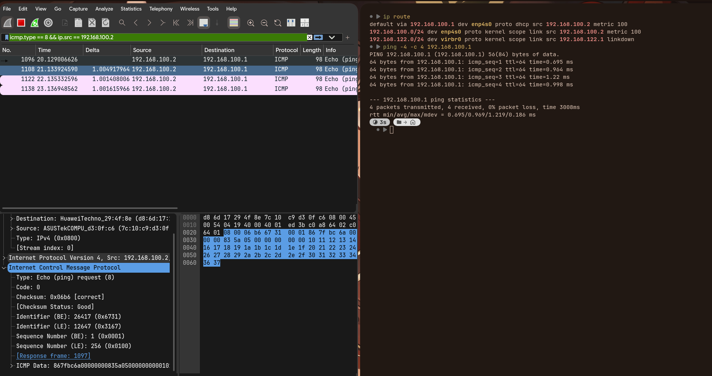

a) ICMP es el protocolo de control y diagnóstico de IP: reporta errores (destino inalcanzable, TTL excedido) y permite consultas (echo). No transporta datos de aplicaciones, solo mensajes de control.

