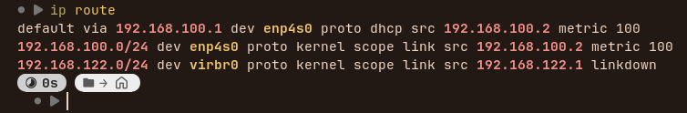
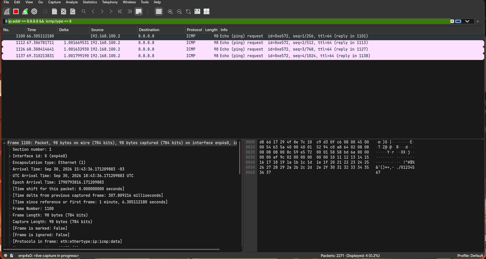

a) Sirve para diagnóstico y reporte de errores de la capa IP: destino inalcanzable, TTL excedido, echo (ping), redirecciones, etc. No transporta datos de aplicaciones: no tiene puertos ni entrega datos a un proceso como TCP o UDP. Es un protocolo de "servicio" para que la red se avise a sí misma que algo pasó

- Reportar errores (destino inalcanzable, TTL expirado)
- Realizar diagnósticos (ping, traceroute)

Tipos de mensajes ICMP principales:
- Echo Request (tipo 8): ping; pregunta si un host está alcanzable
- Echo Reply (tipo 0): respuesta a un Echo Request
- Destination Unreachable (tipo 3): destino inalcanzable
- Time Exceeded (tipo 11): TTL expirado (usado por traceroute)
- Redirect (tipo 5): indica una ruta mejor
- Parameter Problem (tipo 12): error en parámetros IP
- Router Advertisement (tipo 9): anuncia rutas disponibles
- Router Solicitation (tipo 10): solicita información de routers

b)
Viaja dentro de IP: el mensaje ICMP es el payload de un paquete IP (aunque conceptualmente es parte de la capa de red). El receptor sabe que lo que viene es ICMP por el campo Protocol = 1 del encabezado IP (TCP = 6, UDP = 17).
c)
Comprueba si un host es alcanzable y mide el RTT (tiempo de ida y vuelta). Manda un Echo Request (ICMP tipo 8, código 0) y el destino responde con un Echo Reply (tipo 0, código 0). Los distingue el campo Type.

d)
Encabezado de 8 bytes: Type (1 byte), Code (1), Checksum (2), Identifier (2) y Sequence Number (2). Después puede haber datos opcionales (el payload).

## practico wireshark

Ip del PC

Obtener la Ip del gateway

como se ve es 192.168.100.1

prueba de ping al router

prueba de ping a google

prueba con wireshark (google)

**Sistema operativo:** Linux. Lo indican el TTL inicial de 64 y el payload de 56 bytes con relleno incremental (0x10–0x37), valores por defecto del `ping` de Linux (Windows usa TTL 128 y 32 bytes con letras).

| Capa (como la nombra Wireshark) | Dirección/identificador origen | Dirección/identificador destino | ¿Qué campo indica qué protocolo viene "adentro"? |
|---|---|---|---|
| Ethernet II | `7c:10:c9:d3:0f:c6` (ASUSTek, PC) | `d8:6d:17:29:4f:8e` (Huawei, router) | Type: IPv4 (0x0800) |
| Internet Protocol Version 4 | `192.168.100.2` | `8.8.8.8` | Protocol: ICMP (1) |
| Internet Control Message Protocol | No tiene direcciones propias (Type 8, Code 0, Identifier 0xe572, Seq 4) | No tiene direcciones propias | Ninguno: lo que sigue son datos |
| Datos / payload | - | - | 56 bytes (timestamp de 8 B + 8 B de microsegundos + 40 B de relleno 0x10-0x37) |

| Caja | Tamaño (bytes) |
|---|---|
| Ethernet II | 14 |
| IPv4 | 20 |
| ICMP | 8 |
| Datos | 56 |
| **Frame total** | **98** |

---
a) 
### MAC destino 
hacia 8.8.8.8. No es la MAC de 8.8.8.8, es la MAC de tu gateway (el router). Y va a ser la misma que en el ping al gateway (verificalo en la captura). Conclusión: una MAC tiene alcance local (un solo enlace/LAN) y se reescribe en cada salto; una IP tiene alcance extremo a extremo. Tu PC solo necesita la MAC del próximo salto, no la del destino final.

b) 

### Request vs Reply.

Cambian: en Ethernet, MAC origen y destino se intercambian; en IP, IP origen y destino se intercambian, y cambian TTL, Identification y Header Checksum; en ICMP, Type (8 → 0) y Checksum.
Se mantienen: EtherType (0x0800), versión y largo de IP, Protocol (1), Code (0), Identifier, Sequence Number y el payload (el Reply devuelve los mismos datos).
Los cambios de direcciones tienen sentido porque el que responde ahora es el emisor. El Identifier y el Sequence se mantienen porque sirven para emparejar cada Reply con su Request (el Identifier distingue qué proceso ping lo envió; el Sequence, cuál de los paquetes, lo que permite detectar pérdidas y calcular el RTT de cada uno).

c) 
### Payload. 
Está después de los 8 bytes del encabezado ICMP. En Windows son 32 bytes con el patrón abcdefghijklmnopqrstuvwabcdefghi. En Linux son 56 bytes (empiezan con un timestamp de 8 bytes, seguido de bytes incrementales 0x10, 0x11…). En el Reply es igual: el destino "hace eco" de los datos. Que difieran sugiere que cada SO implementa ping a su manera (por eso también se usan estas diferencias para identificar el SO de un host).

d) TTL. El Request de Windows sale con TTL 128 y el de Linux con 64. El Reply de 8.8.8.8 llega con un valor menor al inicial del que respondió (por ejemplo, ~115 si arrancó en 128, o menos si arrancó en 64), porque cada router que atraviesa le resta 1. Si el TTL llega a 0, el router descarta el paquete y avisa con ICMP "Time Exceeded". Esto evita que un paquete circule para siempre en un loop de ruteo (y es la base de traceroute). En el ping al gateway el TTL del Reply es el inicial, porque no hay routers intermedios.

---
2)

a) Problema que resuelve. Traduce una IP a una MAC dentro de la LAN: para mandar una trama Ethernet necesitás la MAC, pero las aplicaciones solo conocen la IP. Es discutible en qué capa va: usa direcciones de capa 3 (IP) pero viaja directo sobre Ethernet, sin encabezado IP (EtherType 0x0806), y sirve a la capa de red. Por eso se lo llama a veces "capa 2.5".

b) Request y Reply. El Request es una pregunta: "¿quién tiene la IP X? Decile a Y (mi IP/MAC)", y se envía por broadcast a toda la LAN. El Reply es la respuesta: "X está en esta MAC", y se envía por unicast solo al que preguntó.

c) Caché ARP. Es una tabla IP → MAC con entradas temporales. Existe para no repetir el broadcast en cada paquete, lo que ahorra tráfico y latencia.

d) Con tus palabras. Comparo la IP destino con mi IP y máscara. Si está en mi subred, mando un ARP Request por broadcast preguntando quién la tiene y el dueño me responde con su MAC. Si está fuera de mi subred, la trama va al gateway, así que resuelvo la MAC del gateway. Guardo el resultado en la caché.

e) Caché del gateway. Debería coincidir con la MAC destino que viste en el ping (verificalo).

