# Universidad Nacional de Córdoba
### Facultad de Ciencias Exactas, Físicas y Naturales


# Redes de Computadoras
## Trabajo Práctico de Nº 5 - Transmision de Datos: de ICMP y ARP a Sockets TCP entre Dos computadoras

| | |
|---|---|
| **Comisión** | ICOMP 24-3 |
| **Docente** | Oliva, Facundo |
| **Año** | 2026 |

**Alumnos:**
- Lamas, Matías Angel
- Torres Sosa, Candelaria
- Baiutti, Bruno Augusto
- Sanchez Oliveto, Juan Cruz
- Vazquez Zuloeta, Fabian
- Pinque, Emanuel Leandro
- Mayne, William Annesley

---

## Item 1: ICMP y primer contacto con Wireshark.

### A) ¿Que es ICMP y para que se usa? ¿Transporta datos de aplicaciones como lo hacen TCP o UDP?

**ICMP** proporciona un medio para transferir mensajes desde los dispositivos de encaminamiento y otros computadoras a un computador. En esencia, ICMP proporciona informacion de realimentacion sobre **problemas del entorno de la comunicacion**. Se usa cuando por ejemplo un datagrama no puede llegar a destino ó cuando el dispositivo de encaminamiento no tiene la capacidad de almacenar temporalmente para reenviar el datagrama ó cuando el dispositivo de encaminamiento indica a una estacion que envie el trafico por una ruta mas corta.

A diferencia de **TCP** o **UDP**, **ICMP** no transporta datos de aplicaciones de usuario, sino que comunica directamente a los modulos de software IP de distintos equipos para tareas de control y gestion.

### B) ¿Que relacion tiene con IP? ¿Viaja dentro de IP, al lado de IP o debajo de IP? ¿Como sabe el receptor que el contenido de un paquete IP es ICMP?

**ICMP** está, a todos los efectos, en el mismo nivel que **IP** en el conjunto de protocolos **TCP/IP**, es un usuario de IP. Cuando se construye un mensaje de ICMP, este se pasa a IP, que encapsula el mensaje con una cabecera IP y despues transmite el datagrama resultante de la forma habitual. Los mensajes ICMP se transmiten en datagramas IP.

Por lo tanto, **ICMP** viaja dentro de la **carga util** de IP.

El receptor indica que la carga util es un mensaje de **ICMP** al examinar el campo **Protocol** del encabezado IPv4, el cual lleva asignado el valor de **1**.

### C) ¿Que hace Ping? ¿Que es un Echo Request y un Echo Reply? ¿Que campos de ICMP permiten distinguirlos?

**PING** es una herramienta de diagnostico de red que sirve para comprobar si una computadora o router remoto esta encendido y accesible a traves de la red, midiendo ademas el tiempo que tarda la señal en ir y volver **RTT** (*Round Trip Time*).

Echo Request y Echo Reply son dos tipos de mensajes de informacion de **ICMP**:
- **Echo Request** (*Peticion de Eco*): es el mensaje que envia tu maquina hacia el equipo de destino solicitandole que confirme si esta activo.
- **Echo Reply** (*Respuesta de Eco*): es el mensaje de respuesta que genera obligatoriamente el equipo de destino cuando recibe una peticion, devolviendo exactamente los mismos datos que le enviaron.

Se diferencian fundamentalmente por el campo **Type** del encabezado **ICMP**, en **IPv4**, el **Echo Request** tiene `type = 8` y el **Echo Reply** tiene `type = 0`.

### D) ¿Que informacion minima contiene un mensaje ICMP de tipo Echo?

Un mensaje ICMP de tipo Echo (Echo Request o Echo Reply) contiene una cabecera fija de 8 bytes mas una carga util de datos opcional (Data).
La informacion que compone la estructura minima de un mensaje Echo consta de los siguientes campos:
- `type` (Tipo - 1 byte): especifica si el mensaje es una peticion (`8`) o una respuesta (`0`).
- `code` (Codigo - 1 byte): en los mensajes Echo siempre vale `0`.
- `checksum` (Suma de Comprobacion - 2 bytes): codigo de comprobacion de errores calculado sobre todo el mensaje ICMP.
- `identifier` (Identificador - 2 bytes): un valor numerico que sirve para identificar la sesion o el proceso del sistema operativo que envio el ping.
- `sequence number` (Numero de Secuencia - 2 bytes): un numero que se incrementa secuencialmente con cada peticion enviada por la aplicacion.
- `data` (Datos opcionales - Longitud variable): un bloque de datos opcional enviado por la aplicacion.

### Configuracion de red del equipo:


### Seleccionar un Echo Request y desplegar el panel de detalles (el del medio). Identificar las capas que muestra Wireshark y completar una tabla:

|Capa|Dir Origen|Dir Destino|Campo|
|----|----------|-----------|-----|
|Ethernet II|Intel_9a:03:ad (34:f6:4b:9a:03:ad)|HuaweiTechno_9a:3d:fd (c0:e1:be:9a:3d:fd)|Type: IPv4 (0x0800)|
|Internet Protocol Version 4|192.168.100.29|8.8.8.8|Protocol: ICMP (1)|
|Internet Control Message Protocol|No aplica|No aplica|No aplica|
|Datos/Payload|No aplica|No aplica|No aplica (32 bytes de Datos)|


### Respuestas
**[A]** La **MAC** destino del Echo Request a 8.8.8.8 es (`c0:e1:be:9a:3d:fd`), no es la MAC de 8.8.8.8, es la de mi router (Huawei). La mmisma MAC aparece como destino en el ping al gateway.
Una direccion **MAC** solo tiene alcance dentro de la red local. Si el destino esta fuera de la LAN, el host envia la trama al router y este la reenvia generando un nuevo encabezado Ethernet en cada salto. La direccion IP, en cambio, identifica el equipo final de punta a punta y se mantiene durante todo el recorrido.

**[B]** Echo Request vs Echo Reply:

|Capa|Cambios|Se Mantienen|
|----|-------|------------|
|Ethernet|MAC de origen y destino se intercambian. Type `0x0800` en request y `0x8100` en el relpy|-|
|IPv4|IP de origen y destino se intercambian|V4, largo de cabecera (20 B), largo total (60 B), flags, fragmentacion, Protocol (1)|
|ICMP|En request `type = 8`; `checksum = 0x4d46`, en reply `type = 0`; `checksum = 0x5546`. |Code (0), indentifier (0x0001), Sequence Number (21), Data (32 bytes)|

**[C]** El Payload del **Ping** esta dentro del mensaje ICMP, a continuacion de los 8 bytes de cabecera, tiene un tamaño de 32 bytes y contiene caracteres ASCII.
En el Reply es identico porque Echo Reply devuelve devuelve los mismos datos recibidos.
El Ping de Windows envia 32 bytes con este patron alfabetico y el ping de Linux envia normalmente 56 bytes de datos.

**[D]** Valor del TTL:

|Mensaje|TTL|
|-------|---|
|Echo Request enviado (a 8.8.8.8 y gateway)|128|
|Echo Reply del gateway|64|
|Echo Reply de 8.8.8.8|119|

No son iguales por que cada equipo asigna su propio TTL inicial al crear un paquete. El Reply lo genera el destino, no mi equipo. Cada router que atravieza el paquete le resta 1 al TTL.
El Reply del gateway llega con 64 por que no cruzo routers intermedios. El de 8.8.8.8 llega con 119, suponiendo un TTL inicial de 128, el paquete abria atravezado unos 9 routes en camino de vuelta (es una estimacion ya que se desconoce el TTL inicial real del servidor).

**[E]** Encapsulacion:
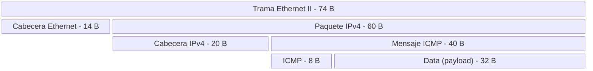

## Item 2: ARP: de una IP a una dirección MAC.

### A) ¿Qué problema resuelve ARP? ¿En qué capa lo ubicarían y por qué es discutible?

El problema que resuelve el protocolo ARP (Address Resolution Protocol) es el de la traducción de direcciones, permitiendo que un dispositivo identifique la dirección física (MAC de capa 2) de otro dispositivo en la misma red local si conoce su dirección IP (capa 3). Es necesario ya que las tarjetas de interfaz de red (NIC) se comunican a nivel de enlace de datos usando las direcciones MAC, mientras que los protocolos de red, como IP, operan con direcciones lógicas.

Generalmente se ubica entre la capa 2 y la 3 del modelo OSI. Su presencia es discutible porque funciona debajo de IP para permitir que los paquetes de IP sean transportados en tramas de enlace de datos, lo que lo hace cercano a la capa 2. Pero también opera directamente sobre la capa 3 (IPv4) y es parte integral de la suite TCP/IP para la conectividad de red, lo que hace que muchos lo identifiquen como capa 3.

### B) ¿Qué es un ARP Request y un ARP Reply? ¿A quién se envía cada uno? 

Un ARP Request es un mensaje de difusión donde una computadora pregunta a toda la red local:"¿Quién tiene esta dirección IP?".Se envía a una dirección de broadcast de capa 2 (ff:ff:ff:ff:ff:ff), lo que significa que llega a todos los dispositivos de la LAN.

Un ARP Reply es el mensaje de respuesta que emite el equipo que reconoce ser el propietario de la IP consultada, informando su propia dirección MAC al equipo que hizo la pregunta. Se envía exclusivamente a la dirección MAC del equipo que originó la solicitud original.


### C) ¿Qué es la caché ARP y por qué existe? 

La caché ARP es una tabla temporal almacenada en la memoria del sistema operativo de la computadora donde se guardan las asociaciones recientemente descubiertas entre direcciones IP y direcciones MAC. Existe por razones de rendimiento y eficiencia en la red. Si la computadora tuviera que enviar un ARP Request cada vez que necesitara comunicarse con el mismo equipo, se generaría una gran cantidad de tráfico innecesario en la red local y se retrasaría la comunicación. La caché permite reutilizar la información ya obtenida de forma instantánea.

### D) Traten de responder con sus palabras: "Tengo la IP de una máquina de mi red local. ¿Cómo sé a qué dirección MAC debo enviarle la trama?" 

Primero voy a consultar en mi caché ARP local para saber si ya guardé a qué MAC corresponde la IP en una comunicación anterior. Si ya está en la caché, armo la trama con esa MAC. Si no la tengo en caché, genero un ARP request solicitando a la red local quién es el dispositivo que tiene esa IP, el dispositivo que tiene esa IP me va a responder indicando su MAC. Luego voy a guardar ese dato en la caché de ARP para poder encapsular y enviar la trama definitiva.

## Item 3: TCP y UDP "a mano" con ncat

### A) ¿Qué significa "establecer una conexión"? ¿Dónde existe una conexión TCP?

Establecer una conexión es que los dos extremos se pongan de acuerdo antes de enviar datos. Lo hacen con el **three-way handshake** (`SYN` → `SYN/ACK` → `ACK`), en el que intercambian números de secuencia iniciales y reservan recursos (buffers, timers, variables de estado). La conexión existe solo en los extremos, como estado dentro del sistema operativo de cada host. No existe en los cables ni en los routers: estos solo reenvían paquetes IP y no saben que pertenecen a una conexión TCP.

### B) ¿Qué es un puerto? ¿Qué identifica el par (IP, puerto)?

Un **puerto** es un número de 16 bits (0–65535) que sirve para multiplexar: permite que varios procesos de un mismo host usen la red a la vez. La IP identifica al host y el puerto identifica al proceso o servicio dentro de él. El par (IP, puerto) identifica un extremo de comunicación (un **socket**). Una conexión TCP se identifica por la 4-upla (IP origen, puerto origen, IP destino, puerto destino).

### C) ¿Qué significa que un proceso esté "escuchando" en un puerto?

El proceso le pidió al SO (con `bind` y `listen`) que reserve ese puerto y le entregue las conexiones o datagramas que lleguen a él. En TCP, el SO responde con `SYN/ACK` a los `SYN` que llegan a ese puerto. Si nadie escucha, el SO rechaza el intento.

### Práctico TCP

**Captura Wireshark:**

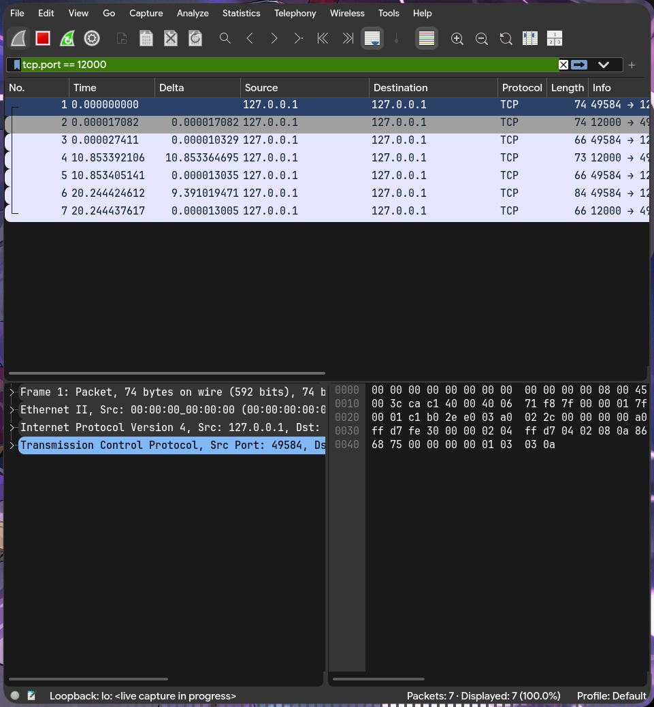

**Terminales:**

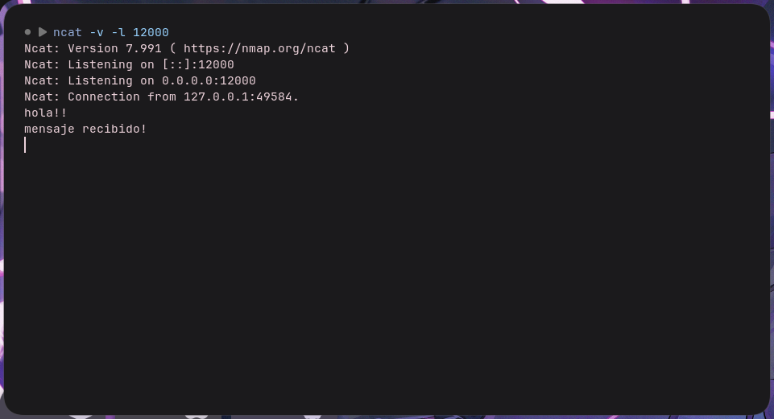

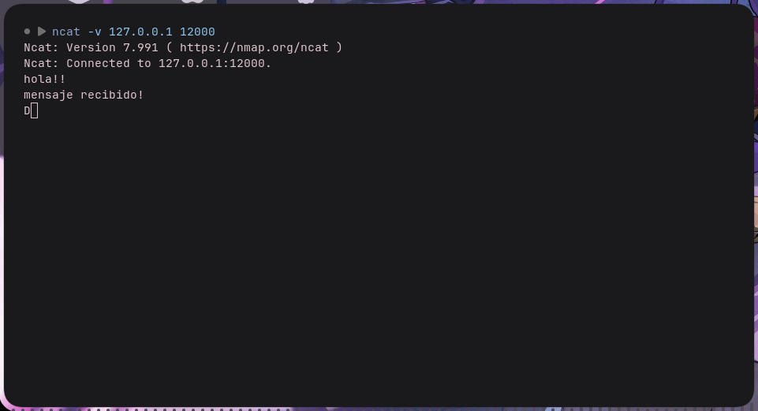

**Datos de la captura:**

```
tshark -r TCP.pcapng 
    1 0.000000000     127.0.0.1 → 127.0.0.1    TCP 74 49584 → 12000 [SYN] Seq=0 Win=65495 Len=0 MSS=65495 SACK_PERM TSval=2252105845 TSecr=0 WS=1024
    2 0.000017082 0.000017082    127.0.0.1 → 127.0.0.1    TCP 74 12000 → 49584 [SYN, ACK] Seq=0 Ack=1 Win=65483 Len=0 MSS=65495 SACK_PERM TSval=3379146092 TSecr=2252105845 WS=1024
    3 0.000027411 0.000010329    127.0.0.1 → 127.0.0.1    TCP 66 49584 → 12000 [ACK] Seq=1 Ack=1 Win=65536 Len=0 TSval=2252105845 TSecr=3379146092
    4 10.853392106 10.853364695    127.0.0.1 → 127.0.0.1    TCP 73 12000 → 49584 [PSH, ACK] Seq=1 Ack=1 Win=65536 Len=7 TSval=3379156946 TSecr=2252105845
    5 10.853405141 0.000013035    127.0.0.1 → 127.0.0.1    TCP 66 49584 → 12000 [ACK] Seq=1 Ack=8 Win=65536 Len=0 TSval=2252116699 TSecr=3379156946
    6 20.244424612 9.391019471    127.0.0.1 → 127.0.0.1    TCP 84 49584 → 12000 [PSH, ACK] Seq=1 Ack=8 Win=65536 Len=18 TSval=2252126090 TSecr=3379156946
    7 20.244437617 0.000013005    127.0.0.1 → 127.0.0.1    TCP 66 12000 → 49584 [ACK] Seq=8 Ack=19 Win=65536 Len=0 TSval=3379166337 TSecr=2252126090
```

### Práctico UDP

**Captura Wireshark:**

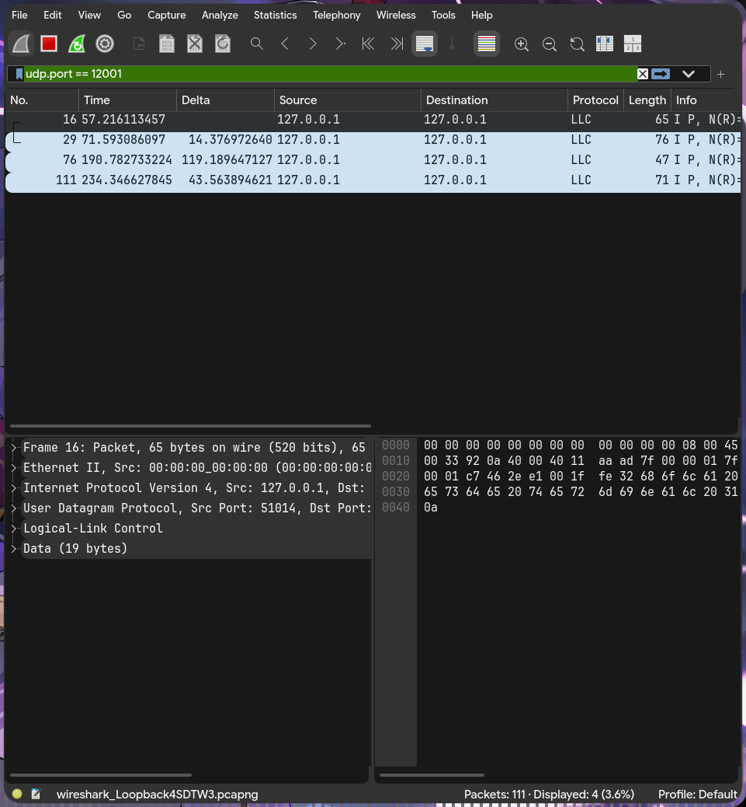

**Terminales:**

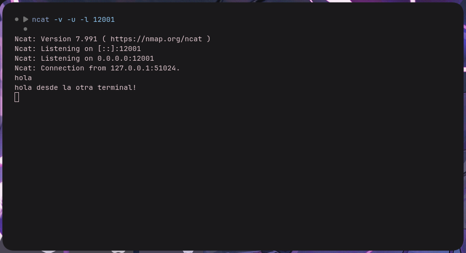

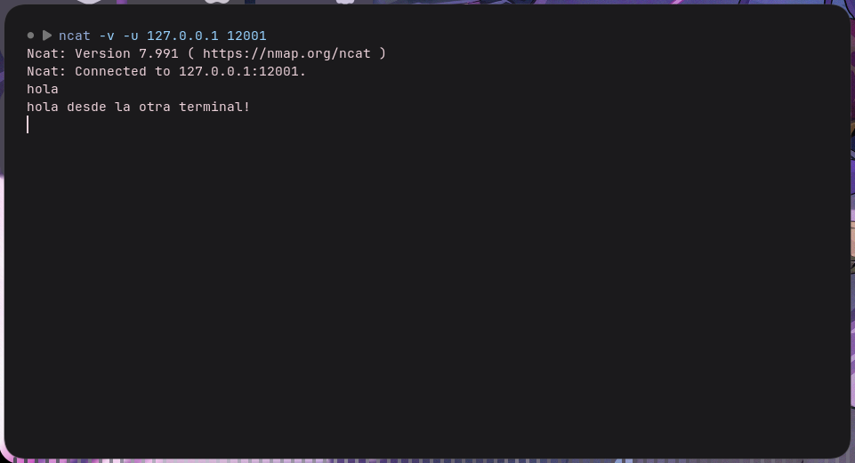

**Datos de la captura:**

```
    1 0.000000000     127.0.0.1 → 127.0.0.1    TCP 66 58576 → 63342 [ACK] Seq=1 Ack=1 Win=64 Len=0 TSval=499136540 TSecr=3479431858
    2 0.000003126 0.000003126    127.0.0.1 → 127.0.0.1    TCP 66 58550 → 63342 [ACK] Seq=1 Ack=1 Win=1631 Len=0 TSval=1744292546 TSecr=3360742043
    3 0.000009528 0.000006402    127.0.0.1 → 127.0.0.1    TCP 66 [TCP ACKed unseen segment] 63342 → 58576 [ACK] Seq=1 Ack=2 Win=64 Len=0 TSval=3479476913 TSecr=499120156
    4 0.000009899 0.000000371    127.0.0.1 → 127.0.0.1    TCP 66 [TCP ACKed unseen segment] 63342 → 58550 [ACK] Seq=1 Ack=2 Win=64 Len=0 TSval=3360787098 TSecr=1744272066
    5 0.000017884 0.000007985    127.0.0.1 → 127.0.0.1    TCP 66 58560 → 63342 [ACK] Seq=1 Ack=1 Win=78 Len=0 TSval=858076343 TSecr=1962185907
    6 0.000022803 0.000004919    127.0.0.1 → 127.0.0.1    TCP 66 58566 → 63342 [ACK] Seq=1 Ack=1 Win=64 Len=0 TSval=2554351675 TSecr=3516550886
    7 0.000025939 0.000003136    127.0.0.1 → 127.0.0.1    TCP 66 58574 → 63342 [ACK] Seq=1 Ack=1 Win=64 Len=0 TSval=2565093131 TSecr=3571448562
    8 0.000029055 0.000003116    127.0.0.1 → 127.0.0.1    TCP 66 58556 → 63342 [ACK] Seq=1 Ack=1 Win=85 Len=0 TSval=304859526 TSecr=2695841910
    9 0.000033523 0.000004468    127.0.0.1 → 127.0.0.1    TCP 66 [TCP ACKed unseen segment] 63342 → 58560 [ACK] Seq=1 Ack=2 Win=64 Len=0 TSval=1962230962 TSecr=858059959
   10 0.000035487 0.000001964    127.0.0.1 → 127.0.0.1    TCP 66 [TCP ACKed unseen segment] 63342 → 58566 [ACK] Seq=1 Ack=2 Win=64 Len=0 TSval=3516595941 TSecr=2554335291
   11 0.000036919 0.000001432    127.0.0.1 → 127.0.0.1    TCP 66 [TCP ACKed unseen segment] 63342 → 58574 [ACK] Seq=1 Ack=2 Win=64 Len=0 TSval=3571493617 TSecr=2565076747
   12 0.000039003 0.000002084    127.0.0.1 → 127.0.0.1    TCP 66 [TCP ACKed unseen segment] 63342 → 58556 [ACK] Seq=1 Ack=2 Win=64 Len=0 TSval=2695886965 TSecr=304839046
   13 14.145426023 14.145387020    127.0.0.1 → 127.0.0.1    LLC 65 I P, N(R)=48, N(S)=54; DSAP 0x68 Individual, SSAP 0x6e Response
   14 22.647209429 8.501783406    127.0.0.1 → 127.0.0.1    LLC 66 I P, N(R)=48, N(S)=54; DSAP 0x68 Individual, SSAP 0x6e Response
```

### Respuestas

### A) ¿Qué pasó en la red cuando ejecutaron el comando del cliente, antes de escribir el primer mensaje? Compárenlo con TCP.

En **UDP** no pasó nada en la red. `ncat -u` solo crea el socket y guarda el destino (`127.0.0.1:12001`). El "Connected to..." es solo un mensaje de ncat, no hay conexión real. En **TCP**, en cambio, al ejecutar el cliente aparece enseguida el handshake: `[SYN]`, `[SYN, ACK]` y `[ACK]`, sin haber escrito nada. Esa diferencia existe porque TCP necesita establecer una conexión con estado en ambos extremos antes de enviar datos, y UDP no.

### B) ¿Cuántos datagramas generó cada mensaje? ¿Hay algo parecido a un ACK?

Cada mensaje generó un datagrama, y no hay nada parecido a un ACK. El emisor no sabe si el mensaje llegó. Si el servidor responde, esa respuesta es otro datagrama independiente con contenido propio, no una confirmación. En **TCP**, cada segmento con datos recibe un `[ACK]`.

### C) Comparen el encabezado UDP con el encabezado TCP de un segmento con datos: ¿qué campos tiene cada uno? ¿Cuántos bytes ocupa cada encabezado?

- **UDP:** 8 bytes fijos. Campos: puerto origen, puerto destino, longitud y checksum.
- **TCP:** 20 bytes como mínimo, más opciones. Campos: puerto origen, puerto destino, número de secuencia, número de ACK, data offset (longitud del encabezado), flags (`SYN`, `ACK`, `FIN`, `PSH`, `RST`), ventana, checksum, puntero urgente y opciones.

### D) ¿Qué pasó en la red al cerrar el cliente con Ctrl+C? ¿Y en TCP?

- **UDP:** no pasó nada. No hay conexión que cerrar, así que no se genera ningún paquete y el servidor no detecta que el cliente se fue.
- **TCP:** se produce un cierre ordenado con `FIN`. En la captura del cierre de la conexión se observa: paquete 1 `[FIN, ACK]`, paquete 2 `[FIN, ACK]` en sentido contrario y paquete 3 `[ACK]` (3 segmentos, porque un `ACK` viajó junto con un `FIN`).

### E) Para enviar la misma frase, ¿cuántos paquetes necesitaron en total con TCP y cuántos con UDP? ¿Qué "compran" con los paquetes extra de TCP?

- **UDP:** 1 paquete.
- **TCP:** unos 9 en total: 3 de handshake, 2 de la frase (el segmento de datos y su ACK) y 4 de cierre (o 3 si el ACK se combina con un FIN).

Los paquetes extra de TCP permiten:

- Entrega confirmada y retransmisión si algo se pierde.
- Orden garantizado y detección de duplicados.
- Control de flujo y de congestión.
- Conocimiento mutuo de que el otro extremo existe y está listo.

### F) ¿Y si nadie escucha?

- **TCP a un puerto cerrado:** el cliente envía un `[SYN]` y el SO responde de inmediato con `[RST, ACK]`. No se completa el handshake y ncat muestra "Connection refused".
- **UDP a un puerto cerrado:** el cliente envía el datagrama (al escribir y presionar Enter) y el SO responde con un **ICMP Destination Unreachable, Type 3 Code 3 (Port Unreachable)**. UDP no tiene mecanismo propio de error, por lo que el aviso llega por ICMP.

**Con TCP:**

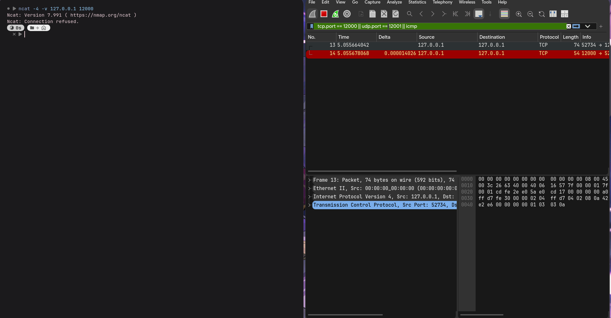

**Con UDP:**

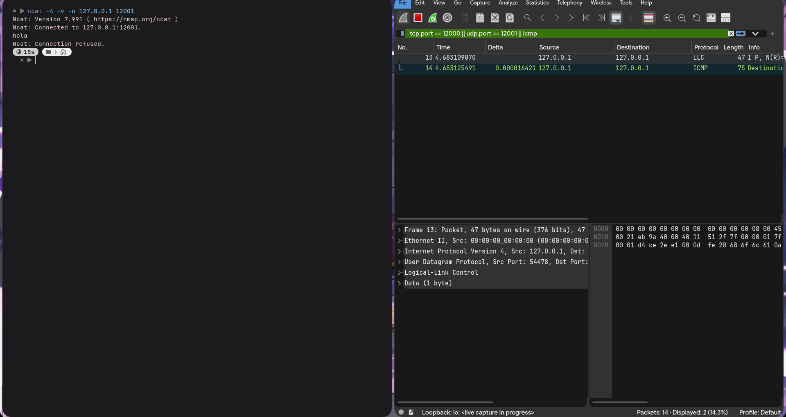

## Item 4: Servidor TCP Mínimo - Sockets en Python

**Captura de las terminales**

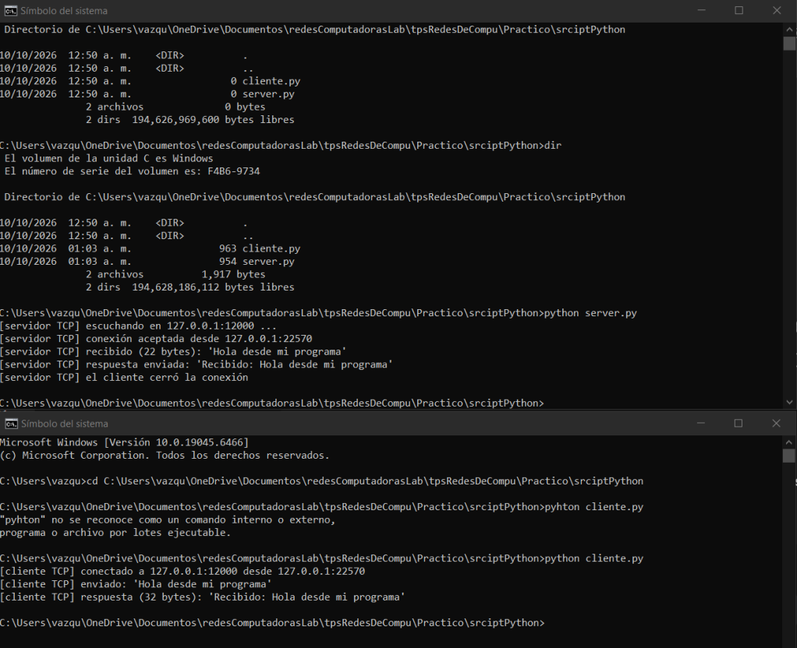

**Captura de wireshark** 

Aqui podemos ver el trafico capturado desde whireshark, una vez ejecutando los codigos tanto de servidor como cliente
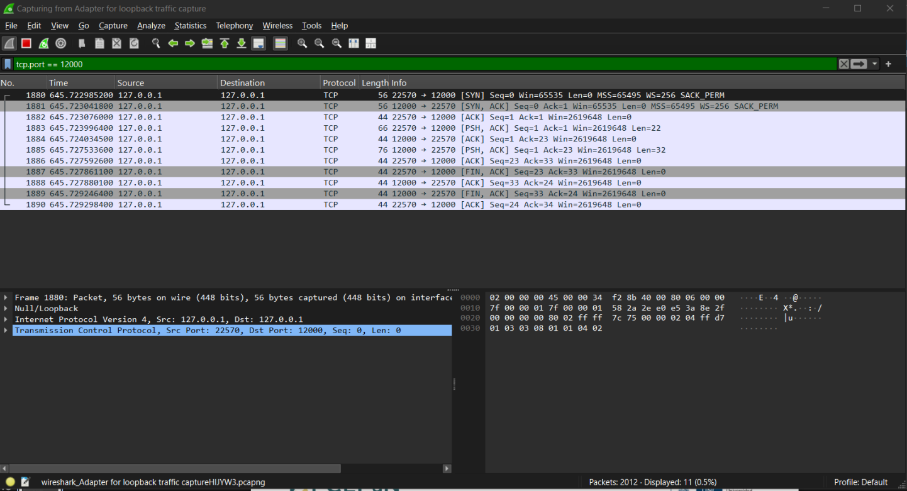

| Llamada a función | ¿Dónde se ejecuta? | ¿Genera tráfico? | Segmentos / Flags observados en la captura |
|---|---|---|---|
| **`socket()`** | Servidor y Cliente | **No** | Estos procesos estan ocurriendo internamente en la computadora y no genera trafico |
| **`bind()`** | Servidor | **No** | Operación local asocia la IP y el puerto `12000` en la tabla de conexiones. |
| **`listen()`** | Servidor | **No** | Modifica el estado interno del socket a `LISTEN` para comenzar a encolar solicitudes entrantes. |
| **`connect()`** | Cliente | **Sí** | Paquetes 1880 a 1881- `#1880`: `22570 -> 12000 [SYN]`<br>- `#1881`: `12000 -> 22570 [SYN, ACK]` |
| **`accept()`** | Servidor | **Sí** | Paquete 1882: `22570 -> 12000 [ACK]`. La función `accept()` se desbloquea al recibir este último ACK del cliente. |
| **`sendall()`** | Servidor y Cliente | **Sí** | Paquetes 1883 y 1885: `#1883`: `22570 -> 12000 [PSH, ACK]` (22 bytes)<br>- `#1885`: `12000 -> 22570 [PSH, ACK]` (32 bytes) |
| **`recv()`** | Servidor y Cliente | **Sí** (Confirmación ACK) | Paquetes 1884 y 1886: `recv()` espera datos. Al recibirlos, el kernel envía confirmaciones `[ACK]` (`Len=0`). |
| **`close()`** | Ambos | **Sí** | Paquetes 1887 a 1890  Cierre ordenado de la conexión TCP con banderas `[FIN, ACK]` y `[ACK]`. |