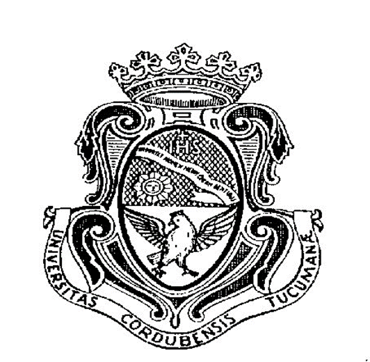

# Universidad Nacional de Córdoba
### Facultad de Ciencias Exactas, Físicas y Naturales

# Redes de Computadoras
## Trabajo Práctico de Nº 5 - Transmision de Datos: de ICMP y ARP a Sockets TCP entre Dos computadoras

| | |
|---|---|
| **Comisión** | ICOMP 24-3 |
| **Docente** | Oliva, Facundo |
| **Año** | 2026 |

**Alumnos:**
- Lamas, Matías Angel
- Torres Sosa, Candelaria
- Baiutti, Bruno Augusto
- Sanchez Oliveto, Juan Cruz
- Vazquez Zuloeta, Fabian
- Pinque, Emanuel Leandro
- Mayne, William Annesley

---

## Item 1: ICMP y primer contacto con Wireshark.
