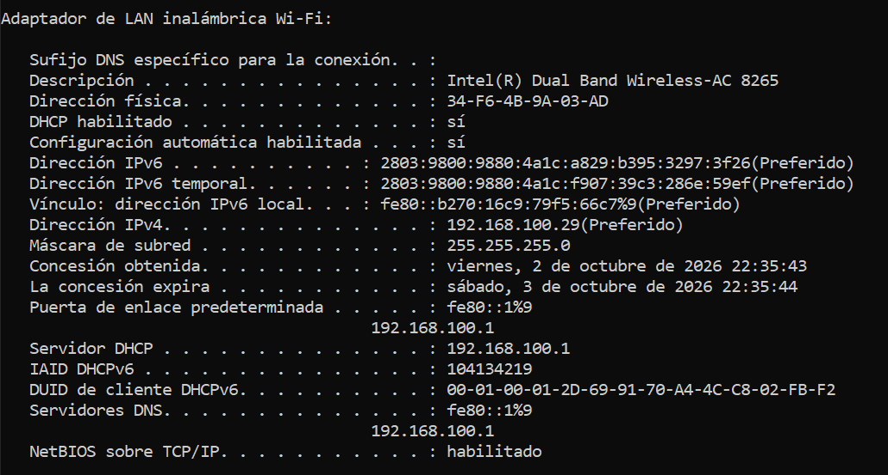
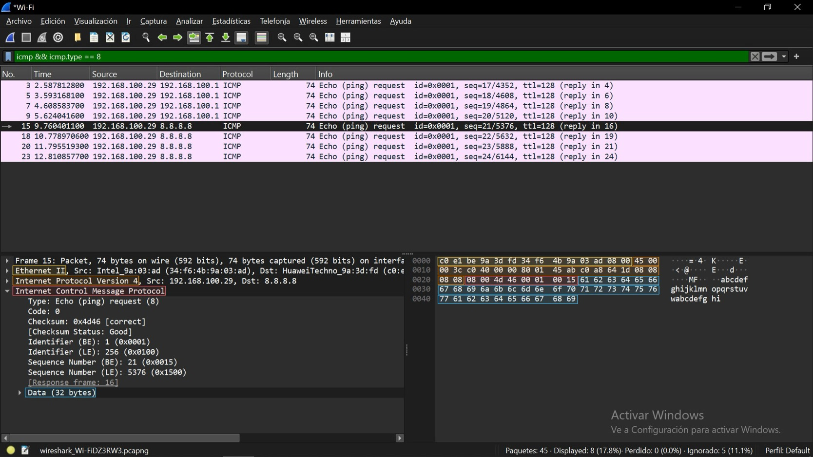
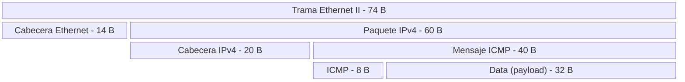

# Universidad Nacional de Córdoba
### Facultad de Ciencias Exactas, Físicas y Naturales

# Redes de Computadoras
## Trabajo Práctico de Nº 5 - Transmision de Datos: de ICMP y ARP a Sockets TCP entre Dos computadoras

| | |
|---|---|
| **Comisión** | ICOMP 24-3 |
| **Docente** | Oliva, Facundo |
| **Año** | 2026 |

**Alumnos:**
- Lamas, Matías Angel
- Torres Sosa, Candelaria
- Baiutti, Bruno Augusto
- Sanchez Oliveto, Juan Cruz
- Vazquez Zuloeta, Fabian
- Pinque, Emanuel Leandro
- Mayne, William Annesley

---

## Item 1: ICMP y primer contacto con Wireshark.

### A) ¿Que es ICMP y para que se usa? ¿Transporta datos de aplicaciones como lo hacen TCP o UDP?

**ICMP** proporciona un medio para transferir mensajes desde los dispositivos de encaminamiento y otros computadoras a un computador. En esencia, ICMP proporciona informacion de realimentacion sobre **problemas del entorno de la comunicacion**. Se usa cuando por ejemplo un datagrama no puede llegar a destino ó cuando el dispositivo de encaminamiento no tiene la capacidad de almacenar temporalmente para reenviar el datagrama ó cuando el dispositivo de encaminamiento indica a una estacion que envie el trafico por una ruta mas corta.

A diferencia de **TCP** o **UDP**, **ICMP** no transporta datos de aplicaciones de usuario, sino que comunica directamente a los modulos de software IP de distintos equipos para tareas de control y gestion.

### B) ¿Que relacion tiene con IP? ¿Viaja dentro de IP, al lado de IP o debajo de IP? ¿Como sabe el receptor que el contenido de un paquete IP es ICMP?

**ICMP** está, a todos los efectos, en el mismo nivel que **IP** en el conjunto de protocolos **TCP/IP**, es un usuario de IP. Cuando se construye un mensaje de ICMP, este se pasa a IP, que encapsula el mensaje con una cabecera IP y despues transmite el datagrama resultante de la forma habitual. Los mensajes ICMP se transmiten en datagramas IP.

Por lo tanto, **ICMP** viaja dentro de la **carga util** de IP.

El receptor indica que la carga util es un mensaje de **ICMP** al examinar el campo **Protocol** del encabezado IPv4, el cual lleva asignado el valor de **1**.

### C) ¿Que hace Ping? ¿Que es un Echo Request y un Echo Reply? ¿Que campos de ICMP permiten distinguirlos?

**PING** es una herramienta de diagnostico de red que sirve para comprobar si una computadora o router remoto esta encendido y accesible a traves de la red, midiendo ademas el tiempo que tarda la señal en ir y volver **RTT** (*Round Trip Time*).

Echo Request y Echo Reply son dos tipos de mensajes de informacion de **ICMP**:
- **Echo Request** (*Peticion de Eco*): es el mensaje que envia tu maquina hacia el equipo de destino solicitandole que confirme si esta activo.
- **Echo Reply** (*Respuesta de Eco*): es el mensaje de respuesta que genera obligatoriamente el equipo de destino cuando recibe una peticion, devolviendo exactamente los mismos datos que le enviaron.

Se diferencian fundamentalmente por el campo **Type** del encabezado **ICMP**, en **IPv4**, el **Echo Request** tiene `type = 8` y el **Echo Reply** tiene `type = 0`.

### D) ¿Que informacion minima contiene un mensaje ICMP de tipo Echo?

Un mensaje ICMP de tipo Echo (Echo Request o Echo Reply) contiene una cabecera fija de 8 bytes mas una carga util de datos opcional (Data).
La informacion que compone la estructura minima de un mensaje Echo consta de los siguientes campos:
- `type` (Tipo - 1 byte): especifica si el mensaje es una peticion (`8`) o una respuesta (`0`).
- `code` (Codigo - 1 byte): en los mensajes Echo siempre vale `0`.
- `checksum` (Suma de Comprobacion - 2 bytes): codigo de comprobacion de errores calculado sobre todo el mensaje ICMP.
- `identifier` (Identificador - 2 bytes): un valor numerico que sirve para identificar la sesion o el proceso del sistema operativo que envio el ping.
- `sequence number` (Numero de Secuencia - 2 bytes): un numero que se incrementa secuencialmente con cada peticion enviada por la aplicacion.
- `data` (Datos opcionales - Longitud variable): un bloque de datos opcional enviado por la aplicacion.

### Configuracion de red del equipo:

### Seleccionar un Echo Request y desplegar el panel de detalles (el del medio). Identificar las capas que muestra Wireshark y completar una tabla:

|Capa|Dir Origen|Dir Destino|Campo|
|----|----------|-----------|-----|
|Ethernet II|Intel_9a:03:ad (34:f6:4b:9a:03:ad)|HuaweiTechno_9a:3d:fd (c0:e1:be:9a:3d:fd)|Type: IPv4 (0x0800)|
|Internet Protocol Version 4|192.168.100.29|8.8.8.8|Protocol: ICMP (1)|
|Internet Control Message Protocol|No aplica|No aplica|No aplica|
|Datos/Payload|No aplica|No aplica|No aplica (32 bytes de Datos)|

### Respuestas
**[A]** La **MAC** destino del Echo Request a 8.8.8.8 es (`c0:e1:be:9a:3d:fd`), no es la MAC de 8.8.8.8, es la de mi router (Huawei). La mmisma MAC aparece como destino en el ping al gateway.
Una direccion **MAC** solo tiene alcance dentro de la red local. Si el destino esta fuera de la LAN, el host envia la trama al router y este la reenvia generando un nuevo encabezado Ethernet en cada salto. La direccion IP, en cambio, identifica el equipo final de punta a punta y se mantiene durante todo el recorrido.

**[B]** Echo Request vs Echo Reply:

|Capa|Cambios|Se Mantienen|
|----|-------|------------|
|Ethernet|MAC de origen y destino se intercambian. Type `0x0800` en request y `0x8100` en el relpy|-|
|IPv4|IP de origen y destino se intercambian|V4, largo de cabecera (20 B), largo total (60 B), flags, fragmentacion, Protocol (1)|
|ICMP|En request `type = 8`; `checksum = 0x4d46`, en reply `type = 0`; `checksum = 0x5546`. |Code (0), indentifier (0x0001), Sequence Number (21), Data (32 bytes)|

**[C]** El Payload del **Ping** esta dentro del mensaje ICMP, a continuacion de los 8 bytes de cabecera, tiene un tamaño de 32 bytes y contiene caracteres ASCII.
En el Reply es identico porque Echo Reply devuelve devuelve los mismos datos recibidos.
El Ping de Windows envia 32 bytes con este patron alfabetico y el ping de Linux envia normalmente 56 bytes de datos.

**[D]** Valor del TTL:

|Mensaje|TTL|
|-------|---|
|Echo Request enviado (a 8.8.8.8 y gateway)|128|
|Echo Reply del gateway|64|
|Echo Reply de 8.8.8.8|119|

No son iguales por que cada equipo asigna su propio TTL inicial al crear un paquete. El Reply lo genera el destino, no mi equipo. Cada router que atravieza el paquete le resta 1 al TTL.
El Reply del gateway llega con 64 por que no cruzo routers intermedios. El de 8.8.8.8 llega con 119, suponiendo un TTL inicial de 128, el paquete abria atravezado unos 9 routes en camino de vuelta (es una estimacion ya que se desconoce el TTL inicial real del servidor).

**[E]** Encapsulacion:

### 2) ARP: de una IP a una direccion MAC

  a) *Adress Resolution Protocol / Protocolo de Resolucion de direcciones* es el mecanismo encargado de traducir una IP loca a una direccion fisica de elace de datos dentro de una misma red local. Basicamente es la capa que se encarga de permitir que un paquete de un emisor que desconoce la direccion fisica dentro de la lan, pueda llegar al receptor
  
  b) Un ARP request es un mensaje broadcast que se envia por la red local a todos  los conectados preguntado por la propiedad de una direccion IP especifica, de forma tal que aquel que la posea envie un mensaje de respuesta asi el emisor conoce al receptor en un handshake. Por otro lado un ARP Reply, es la respuesta al request donde la maquina propietaria de la direccion IP x, responde al emisor con un mensaje unicast, indicando su direccion MAC

  c) La tabla cache ARP es una tabla que va almacenando las direcciones MAC de cada asociacion encontrada en memoria ram. De esta forma nos evitamos saturar la red con constantes mensajes de broadcast y dotamos de memoria al sistema. Puede ser una tabla hash.

  d) Entonces el procedimiento de de busqueda de **MAC** en la red **LAN** se sucede asi:

    - Se revisa la cache ARP en busqueda de una asociacion existente, si exite envio el paquete
    - Si no existe, se envia un ARP request por la red en forma broadcast en busca del propietario de esa IP
    - Se espera el ARP reply del propietario
    - Una vez recibido el ARP se almacena la direccion MAC en cache y se envia el paquete Ethernet

